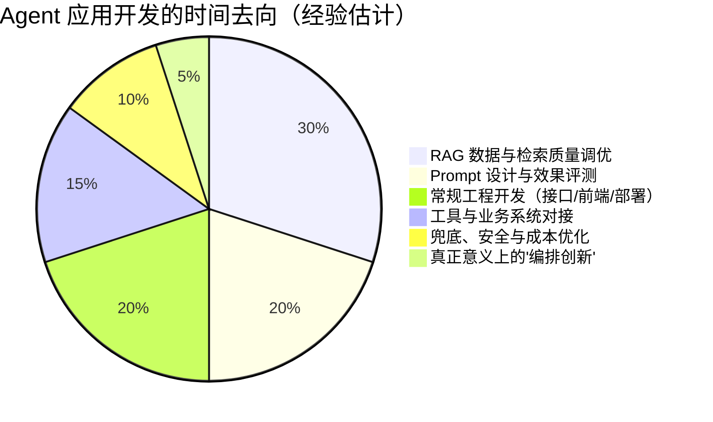

# 国内 Agent 岗位图景：类型、日常与要求

> "Agent 开发岗"是一个被招聘平台过度包装的词。
> 这一章把数百份真实 JD 拆开给你看：这个岗位到底分几种、每天到底在干什么、要求里哪些是真相哪些是许愿——以及前端出身的你，牌桌上到底有什么。

---

## 本章你将解决什么

读完这一章，你应该能：

- 分清国内"Agent 岗"的**三条线**（应用开发 / 算法研究 / 平台工程），以及前端转岗唯一现实的主攻方向
- 说出应用开发岗的**真实日常**——它 70% 的工作可能和你想的不一样
- 对着一份 JD 快速判断：**这是真 Agent 岗，还是蹭热点的普通开发岗**
- 知道面试**考什么**、简历上的 Agent 项目**怎么讲**才加分
- 客观评估自己作为前端工程师的**优势、短板和转岗策略**

> 方法说明：本章结论来自对大厂（腾讯/字节/滴滴/京东）、科研院所（中科院）、创业公司数百份公开 JD 的横向对比，叠加社区（知乎/掘金）的多份 JD 统计分析。样本有时效性，量级判断可靠，具体数字请以你求职时的实时行情为准。

---

## Why 1：先分清三条线——它们是三个完全不同的职业

招聘平台上挂着"Agent"字样的岗位，实际是三条差异巨大的职业路线：

| 线 | 典型 JD 关键词 | 学历/背景门槛 | 前端转岗可行性 |
|---|---|---|---|
| **算法研究** | PyTorch、模型训练、微调、RL、论文 | 硕士起步，顶会加分 | ❌ 基本无缘，别浪费时间 |
| **平台/基建** | vLLM、推理优化、K8s、GPU 调度 | 本科+，偏系统工程 | ⚠️ 有基础设施经验（运维/后端）可尝试 |
| **应用开发** | LangChain、Dify、RAG、Function Calling、Prompt | 本科+，重工程落地 | ✅ **主攻方向**，和前端技能栈重叠最大 |

一个重要的行业事实：**国内绝大部分"Agent 开发岗"的空缺在应用开发线**。原因很朴素——模型本身是少数大厂的战场，而"把模型能力包进具体业务"的需求遍地都是。电商客服、内部知识库、营销文案生成、办公自动化……这些场景不需要你会训练模型，需要你**会用工程手段把模型能力稳定地交付成产品**。

判断口诀：JD 里出现 PyTorch/训练/调参 → 算法线，划走；出现 LangChain/RAG/Agent 编排/业务落地 → 应用线，这就是你的目标。

---

## Why 2：应用开发岗的真实日常——70% 是工程，30% 才是"智能"

很多人想象中的 Agent 开发是"调教模型、设计智能体"，真实日常大致是这个分布：

逐项拆开：

**1. RAG 是绝对的大头。** 企业场景里 Agent 的价值 80% 落在"让模型基于我们的私有资料回答"。所以你会反复做：文档解析与切块（chunking）、知识库构建、检索命中率调优、答案溯源。这部分工作很"脏"——大部分时间在处理格式混乱的内部文档，而不是研究算法。

**2. Prompt 与评测是日常基本功。** 不是写一句神奇的咒语，而是：为每个场景设计 system prompt、构造评测集（eval）、跑分对比、回归测试。注意——**有评测意识的候选人在面试里是稀缺品**，很多人能聊概念，说不出"我怎么知道我的 prompt 改好了"。

**3. 常规工程能力仍是主体。** 接口设计、权限、部署、监控日志——你是工程师，只是恰好服务的是 AI 功能。前端出身在这里直接变现：很多 Agent 产品的交互层（流式输出、会话界面、调试面板）就是前端活。

**4. 工具对接。** 让 Agent 能查订单、能操作内部系统：写工具（Function Calling）、后来越来越多是接 MCP Server。本质是"给模型写 API"，接口设计能力直接迁移。

**5. 兜底与成本。** 模型超时怎么办、幻觉导致错误答案怎么防、token 成本怎么控制。生产 Agent 的代码里，兜底逻辑常常比主逻辑还长。

**一句话总结这份工作：用软件工程的手段，把一个不确定的智能组件，包装成一个确定可交付的产品。** 前半句是你的存量能力，后半句是你转岗要补的新能力。

---

## Why 3：JD 共性拆解——哪些要求是真相，哪些是许愿

横向对比数百份应用线 JD，高频要求高度收敛：

| 类别 | JD 高频词 | 可信度判断 |
|---|---|---|
| 语言 | **Python**（必备） | 真相。生态主语言，但深度要求低于后端岗——能熟练写业务即可 |
| 框架 | **LangChain / LlamaIndex / Dify / Coze** | 半真半假。"精通"通常是许愿，实际面试考的是你懂不懂背后的机制 |
| 核心技术 | **RAG、Function Calling、多智能体、Prompt Engineering** | 真相。RAG 经验最实——能讲清切块/检索/rerank/评测的人当场加分 |
| 协议 | MCP（2026 年起出现频率快速上升） | 新趋势。会写一个 MCP Server 是当下的差异化加分项 |
| 加分项 | 微调经验、全栈能力（React/Vue）、langfuse/LangSmith | 加分项确实是加分项，尤其**全栈**——团队缺的往往就是能一个人把交互层做完的人 |
| 门槛 | 3 年左右经验、本科 | 事实。校招/转岗友好度中上，因为这个方向所有人都新 |

两个针对转岗者的解读：

- **"精通 XX 框架"不用怕**。框架半年一换代（LangChain 自己都大改过几轮），面试官真正考的是框架背后的机制理解：工具调用的循环怎么跑、RAG 每一步为什么存在。这正是《Agent 实战》按机制而非 API 组织内容的原因。
- **"微调经验"对应用线不是硬门槛**。应用岗的微调需求是少数场景，JD 里它几乎总在"加分"栏。把 RAG 和评测做扎实，性价比远高于啃微调。

---

## Why 4：面试考什么、项目怎么讲

应用线面试的典型结构（按出现频率）：

**必考一：RAG 全链路。** "你们的文档怎么切块？检索不准怎么排查？怎么评估效果？"——三个问题层层递进，答不出评估环节的人会被归类为"只会跑 demo"。准备口径：切块策略及理由 → 检索优化（混合检索/rerank）→ 评测方法（评测集 + 命中率/回答质量指标）。

**必考二：工具调用机制。** Function Calling 的完整循环（模型决定调用 → 你的代码执行 → 结果回填 → 模型继续），以及错误处理。追问常是："工具执行失败模型怎么办？"——考察你是否真在生产环境做过。

**高频三：幻觉治理与兜底设计。** "你们怎么防止模型胡说？"标准好答案 = 分层：检索约束 + 引用溯源 + 输出校验 + 兜底话术 + 人工升级通道。

**高频四：一个真实项目深挖。** STAR 不够，要讲**取舍**：为什么选 Dify 又为什么离开、为什么这个场景不用多 Agent、成本怎么控制。有真实踩坑细节的项目，胜过三个 toy demo。

**简历项目的黄金结构**（用你自己有的牌）：

> 背景（真实业务）→ 方案选型（对比过什么，为什么这么选）→ 机制细节（RAG 切块/工具设计，说出具体数字）→ 评测与结果（怎么证明它好，命中率/满意度提升了多少）→ 踩坑与复盘（至少一个有深度的坑）

《Agent 实战》那本书的所有实战章节（复刻烹饪助手、重构 AI 服务、宠物日记工作流）都是按这个结构设计的——学完你手上就有三个能讲的项目。

---

## 前端转岗：优势、短板与策略

**你的真实优势**（JD 视角验证过）：
- **全栈交付能力**：Agent 产品的交互层（流式 UI、会话状态、调试面板）就是前端；小团队最缺"一个人能做完"的人
- **接口设计直觉**：工具调用的本质是给模型设计 API；你在 TS 里养成的类型思维直接迁移到结构化输出
- **工程审美**：对加载态、错误处理、降级体验的敏感，是多数纯 Python 背景候选人的盲区

**要诚实面对的短板**：
- Python 熟练度（必备项，绕不开——附录的速通章 + 实战书里的对照可以补到"够用"）
- 评测与数据直觉（前端的测试是确定性的，Agent 的评测是统计式的，需要专门建立）
- 对模型行为的体感（只能靠大量实操喂出来——没有捷径，这也是实战书存在的理由）

**策略建议**：
1. **别从零投"Agent 工程师"**，先用"全栈工程师（AI 方向）"的姿势切入——你现有经验 + AI 项目证据，比裸转 Agent 岗的胜率高一个量级
2. **简历上放 2-3 个有深度的 AI 项目**（不是 demo，是有取舍、有评测、有踩坑的），面试导向会瞬间不同
3. **把劣势转化为故事**：转岗本身就是一个"学习能力 + 工程判断"的证据——前提是你能讲出一路上做过的技术取舍

---

## 本章检查清单

- [ ] 我能分清算法/平台/应用三条线，并知道为什么主攻应用线
- [ ] 我能说出应用开发岗时间分布的大头是 RAG 与工程，而不是"调教模型"
- [ ] 拿到一份 JD，我能在 30 秒内判断它是真 Agent 岗还是蹭热点
- [ ] 我知道面试四大件（RAG 全链路 / 工具调用 / 幻觉治理 / 项目深挖）各自的准备口径
- [ ] 我能列出自己作为前端的三个优势和三个短板，并各有一条应对

---

## 下一步

行业认知补齐了。接下来两条路：继续读**《行业与生态格局》**（建设中）建立厂商与生态坐标系；或者直接开始动手——**《Agent 实战：从 Dify 到 LangGraph》**第 1 章，20 分钟跑通你的第一个应用。
