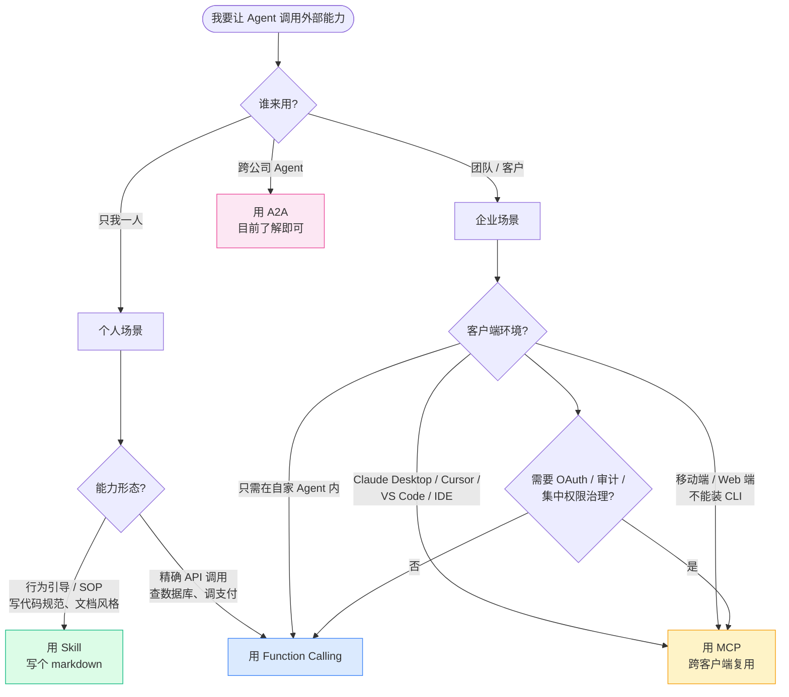

# Phase 4 · 工具调用四层栈

> 这一章是 2026 年最容易被讲错的章节。
> 网上充斥着"MCP 已死"或"Function Calling 就够了"的极端说法。
> 本章用一线证据校准：四层栈各司其职，谁也没取代谁。

---

## 本章你将解决什么

读完这一章，你应该能：

- 讲清 **Function Calling / Skill / MCP / A2A** 四层栈各自的职责
- 在任何业务场景下，**画出决策树**判断该用哪一层
- 实现**第一个 Function Calling** 工具（Python + Node 双版）
- 写出**第一个 Skill 文件**（10 分钟搞定）
- 跑通一个**现成的 MCP Server**（不实现，会用即可）
- 在工程评审时讲清"为什么 MCP 没过时"——这是 2026 年的关键认知

> 前置知识：Phase 0 术语地基 + Phase 3 Qwen 接入。

---

## 为什么这一章重要

工具调用是 2024-2026 年变化最大的领域：

- **2024**：Function Calling 一统天下
- **2025 上**：MCP 协议爆发，企业级集成标配
- **2025 下**：Anthropic 推出 Skills，轻量场景新选择
- **2026**：A2A 协议出现，跨 Agent 协作开始

网上充斥着"MCP 已死"或"Function Calling 就够了"的极端说法。这一章用一线证据校准：四层栈各司其职，谁也没取代谁。

---

## Why 1：为什么是"四层栈"不是"四个替代品"

2025-2026 业内最大的认知混乱：**"Skill 取代 MCP 了"** 或 **"MCP 取代 Function Calling 了"**。两种说法都错。

### 正确的心智模型

```
┌────────────────────────────────────────────┐
│ A2A（Agent-to-Agent）                       │
│   跨组织、跨公司的 Agent 协作                │
│   Google 主推，2025-04 发布                  │
├────────────────────────────────────────────┤
│ Agent Skills                                 │
│   编码"如何做事"的自然语言指令               │
│   Anthropic 2025-10 发布                     │
├────────────────────────────────────────────┤
│ MCP（Model Context Protocol）                │
│   连接外部工具/数据的标准协议                 │
│   Anthropic 2024-11 发布                     │
├────────────────────────────────────────────┤
│ Function Calling                             │
│   模型层的原生能力：输出结构化调用参数         │
│   所有主流模型都支持                          │
└────────────────────────────────────────────┘
```

**核心隐喻**：网络协议栈。TCP 没有取代 IP，HTTP 没有取代 TCP——它们各管一层。同样，Skill 没有取代 MCP，MCP 没有取代 Function Calling。

### 各层一句话定位

| 层 | 一句话 | 类比 |
|----|------|------|
| Function Calling | 模型"想"要调什么 | 浏览器的 onclick 事件 |
| Skill | 用自然语言告诉模型"怎么做事" | 一份操作手册（SOP） |
| MCP | 标准化的工具/数据连接协议 | USB-C 接口 |
| A2A | 不同 Agent 之间互相通信 | HTTP API |

---

## Why 2：为什么"Skill 取代 MCP"的说法只对了一半

2025-10 Anthropic 发布 Claude Skills 后，HN / Reddit 出现大量"MCP 已死"讨论。这是事实吗？

### 一线证据（2026-06 真实数据）

**MCP 仍然主流的证据**：
- PulseMCP 注册 server **5,500+**（持续增长）
- 2026-07-28 MCP 规范 RC，是发布以来最大修订
- 主流工程实践要求："工具调用（Function Call / **MCP 协议**）"——一线 Agent 项目已普遍把 MCP 写入工程能力要求
- 阿里百炼、智谱 GLM、DeepSeek 全部原生支持 MCP
- HN 高赞评论（OpenAI MCP 负责人 mxstbr）："MCP 作为模型直连层可能死，**作为协议 hell no**"

**Skill 在挤压 MCP 的证据**：
- Simon Willison（Python 大佬）："我已经把大半 MCP server 换成 Skill + CLI 了"
- 个人开发者的 coding agent 场景，Skill 更轻量
- Token 成本敏感场景，Skill 更省

### 真相：分层互补，不是替代

| 场景 | Skill 在赢 | MCP 在赢 |
|------|-----------|---------|
| 个人 coding agent | ✅ Skill + CLI 够用 | |
| 企业 SaaS 集成 | | ✅ 没有 CLI/API 的公司只能建 MCP server |
| 移动端 / Web 端 agent | | ✅ ChatGPT iOS、Claude Web 只能用 MCP |
| 身份治理 / OAuth / 审计 | | ✅ MCP 把 secret 关在后面，dev/agent 都看不到 token |
| 跨客户端复用（Claude/Cursor/Codex） | | ✅ 一个 MCP server 同时驱动多个客户端 |
| 能力相对静态、token 敏感 | ✅ 写个 markdown 文件 | |
| 跨公司 Agent 协作 | | → 这是 A2A 的领域 |

**工程标准答案**：
> "Skill 和 MCP 是分层互补关系。Skill 是 LLM 解释自然语言指令的模式，适合个人/能力静态场景；MCP 是连接工具/数据的协议，适合企业/合规/跨端场景。我会在 coding agent 里优先用 Skill，在给团队/客户做集成时用 MCP。"

---

## 第 1 层：Function Calling（必学，所有 Agent 基础）

### 严格定义回顾

模型在推理过程中**输出结构化 JSON**，告诉你的代码"我想调用什么函数、传什么参数"。**模型只决策，不执行**——执行权永远在你的代码手里。

### Python 最小实现（接 Qwen）

```python
"""
Phase 4 · Function Calling 最小示例
依赖：uv add openai python-dotenv
"""
import os
import json
from dotenv import load_dotenv
from openai import OpenAI

load_dotenv()
client = OpenAI(
    api_key=os.getenv("DASHSCOPE_API_KEY"),
    base_url="https://dashscope.aliyuncs.com/compatible-mode/v1",
)

# 1. 定义工具 schema（这是给模型看的"接口文档"）
tools = [
    {
        "type": "function",
        "function": {
            "name": "get_weather",
            "description": "查询指定城市的当前天气",
            "parameters": {
                "type": "object",
                "properties": {
                    "city": {
                        "type": "string",
                        "description": "城市名，例如 \"杭州\"、\"北京\""
                    },
                    "unit": {
                        "type": "string",
                        "enum": ["celsius", "fahrenheit"],
                        "description": "温度单位，默认摄氏度"
                    }
                },
                "required": ["city"]
            }
        }
    }
]

# 2. 真实执行函数（你的代码）
def get_weather(city: str, unit: str = "celsius") -> dict:
    # 这里 mock 一下，生产环境接真实天气 API
    return {"city": city, "temp": 26, "unit": "°C", "weather": "晴"}

# 3. 工具调度表
FUNCTIONS = {
    "get_weather": get_weather,
}

# 4. Agent 循环
def run_agent(user_input: str):
    messages = [
        {"role": "system", "content": "你是一个助手。需要时调用工具获取数据。"},
        {"role": "user", "content": user_input}
    ]

    for _ in range(5):  # 最多循环 5 次，防止死循环
        response = client.chat.completions.create(
            model="qwen-plus",
            messages=messages,
            tools=tools,
            tool_choice="auto",  # 让模型自己决定是否调用
        )

        msg = response.choices[0].message

        # 模型决定不调用工具 → 直接回答，结束
        if not msg.tool_calls:
            return msg.content

        # 模型决定调用工具 → 执行后把结果送回模型
        messages.append(msg)
        for call in msg.tool_calls:
            func_name = call.function.name
            args = json.loads(call.function.arguments)
            print(f"→ 调用 {func_name}({args})")

            result = FUNCTIONS[func_name](**args)

            # 把工具结果作为 tool 角色送回
            messages.append({
                "role": "tool",
                "tool_call_id": call.id,
                "content": json.dumps(result, ensure_ascii=False),
            })
        # 进入下一轮循环，让模型基于工具结果继续推理

    return "Agent 达到最大步数限制"

print(run_agent("杭州今天多少度？需要带外套吗？"))
```

### Node.js 版核心片段

```typescript
const tools = [{
  type: "function",
  function: {
    name: "get_weather",
    description: "查询指定城市的当前天气",
    parameters: {
      type: "object",
      properties: {
        city: { type: "string", description: "城市名" }
      },
      required: ["city"]
    }
  }
}]

const response = await client.chat.completions.create({
  model: "qwen-plus",
  messages,
  tools,
  tool_choice: "auto",
})

if (response.choices[0].message.tool_calls) {
  for (const call of response.choices[0].message.tool_calls) {
    const args = JSON.parse(call.function.arguments)
    const result = await getWeather(args.city)
    // 把结果送回模型继续推理
  }
}
```

### 工具设计的 5 条原则

| # | 原则 | 反例 | 正例 |
|---|------|------|------|
| 1 | **description 要写清楚** | `"查询数据"` | `"查询指定城市的当前天气，含温度、天气状况、风力"` |
| 2 | **参数最小化** | 7 个必填参数 | 1-2 个必填，其余 optional |
| 3 | **类型用 enum** | `"unit": "string"` | `"unit": {"type":"string","enum":["celsius","fahrenheit"]}` |
| 4 | **错误信息要友好** | `"error": "invalid"` | `"error": "city 'xyz' not found, please use Chinese name like '杭州'"` |
| 5 | **副作用要明示** | 工具叫 `process_data` | 工具叫 `delete_user`（让模型理解风险） |

### 安全模型（为什么 LLM 不直接执行）

这是工程上最优雅的设计：**LLM 负责"决策"，你的代码负责"执行"，权利分层**。

- LLM 永远不能直接执行 SQL、删除文件、调用真实支付接口
- 你的代码是"权限边界"——可以选择不执行模型的某些调用
- 这让你能加：审计日志、人工审批、速率限制、参数校验

**工程价值**：能讲清这个权利分层，是中高级 Agent 工程师的核心能力。

---

## 第 2 层：Agent Skills（轻量、自然语言、个人场景）

### Skill 是什么

一个**文件夹**，包含：
- `SKILL.md`：YAML frontmatter（`name` + **单行 `description`**）+ Markdown 正文
- 可选：脚本（Python/Bash）、`REFERENCE.md`、其他资源

模型在会话开始时只读 frontmatter（几十 token），用到时才加载全文。

### Skill 最小示例

文件 `~/.claude/skills/commit-convention/SKILL.md`：

```markdown
---
name: commit-convention
description: 按照约定式提交规范（Conventional Commits）写 git commit message
---

# 提交信息规范

## 格式
\`\`\`
<type>(<scope>): <subject>

<body>

<footer>
\`\`\`

## type 必须是以下之一
- feat: 新功能
- fix: bug 修复
- docs: 文档变更
- refactor: 重构（不改功能也不修 bug）
- perf: 性能优化
- test: 测试相关
- chore: 构建/工具链

## 示例
feat(auth): 加入 JWT 续期机制

fix(api): 修复 /users 接口 404

## 反例（不要这样写）
❌ update
❌ fix bug
❌ 修改了一些东西
```

写完这个文件，下次你对 Claude Code 说"帮我提交"，它就会按这个规范写 commit message。

### Skill vs Function Calling 的关键差异

| 维度 | Function Calling | Skill |
|------|-----------------|-------|
| 执行模型 | 确定性 API 调用，固定 schema | LLM 解释自然语言指令 |
| 网络开销 | 每次调用有网络延迟 | 本地，无网络开销 |
| 维护 | 改代码 + 改 schema | 改 markdown |
| 失败模式 | 选错工具 | 误解指令 + 选错工具 |
| 适合 | 精确操作（查天气、查数据库） | 行为引导（写代码规范、文档风格） |

### 什么时候用 Skill

- **个人 coding agent**：写 markdown 文件比写 MCP server 快 10 倍
- **能力相对静态**：写一次 SOP，用很久
- **token 成本敏感**：Skill frontmatter 几十 token，MCP server schema 可能数千 token
- **快速试错 / PoC**：Skill 几分钟写完，可立刻验证

### 主流厂商对 Skill 的支持

- **阿里千问云**（2026-05 上线）：明确把核心能力**封装为 Skills + CLI 工具**
- **字节扣子 Coze 2.5**：在 Plugin 基础上引入"技能（Skill）"概念，封装使用策略
- **Claude Code**：原生支持
- **OpenAI**：通过 Agents SDK 的 "Instructions" 实现类似能力

**Skill 是 2026 年的趋势**，但不会取代 MCP——见下一节。

---

## 第 3 层：MCP（企业 / SaaS / 多用户场景）

### MCP 的核心价值

> "MCP provides the capability, Skills define the process."

**1. 标准化集成**：一个 MCP server 同时驱动 Claude Desktop / Claude Code / Cursor / Cline / VS Code / ChatGPT Connectors。

**2. 身份治理**：OAuth + 集中 revoke + 审计日志。把 secret 关在 MCP server 后面，开发者和 agent 都看不到 token。

**3. 跨端复用**：ChatGPT iOS、Claude Web 这种**不能装 CLI 的客户端**，只能用 MCP。

**4. 企业分发**：300 个员工共享一个能力，热更新——必须服务端分发，CLI/Skill 做不到。

### 主流 MCP 生态（2026 现状）

| 厂商 | MCP 支持 | 实操路径 |
|------|---------|---------|
| 阿里云百炼 | ✅ 原生 | 控制台 → 应用 → MCP |
| 智谱 GLM | ✅ 官方 server | 视觉理解 / 联网搜索 / 网页读取 |
| DeepSeek | ✅ 原生 | V3/V4/R1 全系列 |
| 字节扣子 | 类似的 Plugin 概念 | 平台内置 |

### 跑通第一个现成的 MCP Server（10 分钟）

不用自己实现，**先用现成的**。最常用的是 [Firecrawl MCP](https://github.com/firecrawl/firecrawl-mcp)（网页抓取）和 [Playwright MCP](https://github.com/executeautomation/mcp-playwright)（浏览器自动化）。

以 Playwright MCP 为例，在 Claude Desktop 配置文件加：

```json
{
  "mcpServers": {
    "playwright": {
      "command": "npx",
      "args": ["@playwright/mcp@latest"]
    }
  }
}
```

重启 Claude Desktop，对话里说"打开 baidu.com 搜索'Qwen 模型'，截图给我"——Claude 会自动调用 MCP server 控制浏览器。

### 自己实现 MCP server 的精力分配

**建议**：用 Claude Code 帮你写（vibe coding 一晚搞定）。spec 看官方一遍即可，不要死磕。

### 什么时候该用 MCP（不是 Skill）

```
场景判断：
├─ 个人 / coding agent / 能力静态 → Skill
├─ 给团队/客户做集成 → MCP
├─ 移动端 / Web 端 agent → MCP（唯一选项）
├─ 需要 OAuth / 审计 / 集中 revoke → MCP
└─ 跨客户端复用（Claude/Cursor/Codex） → MCP
```

---

## 第 4 层：A2A（Agent-to-Agent，跨组织协作）

### 一句话理解

Google 主推（2025-04 发布），目标是让**不同公司、不同框架的 Agent 能互相对话**——比如你的 Agent 调我的 Agent，我的 Agent 调 Anthropic 的 Agent。

### 现状（2026-06）

- **早期阶段**：规范刚发布一年多，落地案例不多
- **了解即可**：作为前端转 Agent 的人，**不需要现在投入精力**
- **未来趋势**：等头部 SaaS 都暴露 A2A 接口后，再学不迟

### 什么时候你会用到

- 你给公司做了 Agent A，需要调用供应商的 Agent B（如调外部报销审批 Agent）
- 你做平台型产品，允许第三方 Agent 接入

这种场景对多数项目来说还很少见，**作为了解即可**。

---

## 一张图总结决策树



---

## 精力分配建议（基于一线证据）

如果你是前端转 Agent，本章节的精力分配：

| 层 | 投入 | 产出 |
|----|------|------|
| Function Calling | **70%** | 必学，所有 Agent 工程基础 |
| Skill | **20%** | 一天写 2-3 个 Skill，立刻可用 |
| MCP | **10%** | 跑通 1-2 个现成 server，知道怎么用 |
| A2A | 了解 | 知道有这东西即可，不用学 |

**关键提醒**：不要陷入"MCP spec 全集"或"自己实现一个完美 MCP server"的坑。能用现成的、能用 Skill 替代的，**优先用轻量方案**。

---

## 常见坑

> **坑 1：把所有外部调用都包装成 MCP server**
> 个人项目里把"查天气"也写成 MCP server，是典型的过度工程。Skill 或直接 Function Calling 就够。

> **坑 2：工具 description 写得太短**
> LLM 选工具完全靠 description。写 "查数据" → 模型不知道啥时候该调；写 "查询指定城市的当前天气，含温度/天气/风力" → 模型准确调用。

> **坑 3：相信"MCP 已死"的极端说法**
> 一线证据（5,500+ server、主流公司已写入工程能力要求）证明 MCP 在企业场景反而更主流。不要因为读了 HN 几个高赞评论就放弃学 MCP。

> **坑 4：Function Calling 不做循环上限**
> 模型可能死循环调用工具，烧钱。生产环境必须 `max_iterations` 限制（参考示例代码里的 `for _ in range(5)`）。

> **坑 5：相信"模型会自己处理错误"**
> 模型不会。你的代码必须校验工具参数、处理异常、回传友好错误信息给模型，否则模型会反复重试。

---

## 本章检查清单

- [ ] 我能讲清四层栈各管的职责（不混淆）
- [ ] 我跑通了 Function Calling 示例（Python 或 Node 至少一个）
- [ ] 我写过至少一个 Skill（markdown 文件）
- [ ] 我跑通了至少一个现成的 MCP Server（Playwright 或 Firecrawl）
- [ ] 我能在工程评审时讲清"为什么 Skill 没有取代 MCP"
- [ ] 我看到任何业务场景，能用决策树判断该用哪一层
- [ ] 我的 Function Calling 代码有循环上限和错误处理

---

## 下一步

工具调用搞定，Agent 有了"手"。接下来两章是 Agent 的另外两大支柱：

- **Phase 5 · Prompt 工程**——把 prompt 当接口设计，让 Agent "说得对"
- **Phase 6 · RAG 与企业知识库**——给 Agent "外挂记忆"，让它"知道得多"

建议按顺序读。读完 Phase 5/6，你就具备做完整 Agent 项目的所有基础能力。
