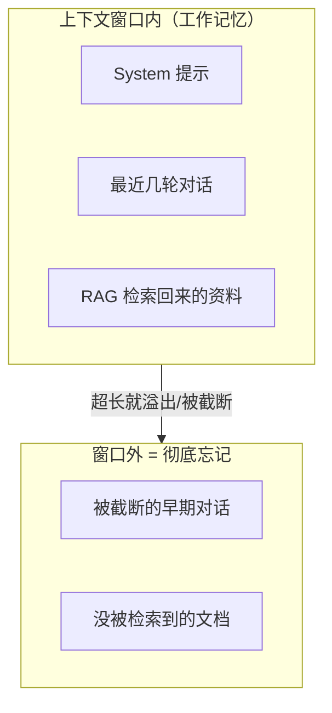

# 上下文与账单

> 两个工程事实：窗口是工作记忆；输入也全款计费。

## 事实一：窗口 = 工作记忆，不是硬盘

推论速查：

| 现象 | 真相 | 对策 |
|---|---|---|
| "聊着聊着忘了开头" | 历史被截断，不是 bug | 记忆管理：摘要 / 关键信息回填 |
| "塞了全量文档还是答不准" | 中间内容利用率低 + 太贵 | 检索定位，**少塞准塞** |
| 模型不知道公司内部知识 | 训练没见过，窗口里也没有 | RAG 注入 |

## 事实二：token = 钱，输入输出都算

一次调用的成本公式：

> **成本 = (输入 token × 输入单价) + (输出 token × 输出单价)**

三个常被忽略的点：

1. **多轮对话是雪球**——第 10 轮时，前 9 轮全部作为输入再计费一遍
2. **输出比输入贵**——主流模型输出单价是输入的 2~4 倍，"让模型少废话"是真实降本手段
3. **RAG 的检索质量 = 成本**——检索不准 → 塞更多文档 → 输入爆炸。**优化检索就是优化账单**

## 一张成本直觉表（量级感知）

| 操作 | token 量级 | 说明 |
|---|---|---|
| 一句问答 | ~500 | 忽略不计 |
| 带 3 段检索资料的回答 | ~3K | RAG 单次常态 |
| 塞一个 50 页 PDF | ~50K+ | 每问一次都付一遍 |
| 10 轮长对话（无记忆管理） | 滚雪球 | 第 10 轮输入 ≈ 全历史 |

## 工程口诀

> **能用检索解决的不塞全量；能放 system 的不放 user；能摘要的不带原文；能要短答的不让它长篇。**

→ 认知差不多了，看真实市场：[国内岗位地图](/guides/agent-guide/job-map)
