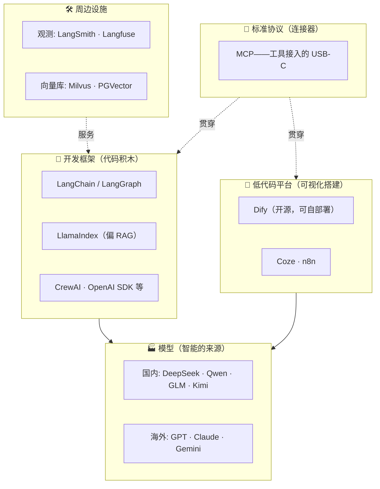

# 生态一页纸

> 建坐标系，不背名单。今天记住的结构，比记住的版本号活得久。

## 生态地图

## 选型速查（先记住"默认答案"）

| 问题 | 默认答案 | 什么时候换 |
|---|---|---|
| 用什么模型起步 | **DeepSeek**（便宜 + 国内直连 + 兼容 OpenAI 协议） | 要特定能力再换，代码别绑死单一厂商 |
| 入门平台 | **Dify**（开源可自部署，流程可视化） | Coze 适合更快做 bot |
| 代码框架 | **LangChain → LangGraph**（生态最大，JD 高频） | 重 RAG 场景看 LlamaIndex |
| 工具接入 | **MCP**（写一次到处用，2026 事实标准） | 简单场景原生 FC 更轻 |
| 观测 | Langfuse（开源自部署）/ LangSmith（官方） | 起步可先日志凑合 |
| 向量库 | **PGVector**（已有 Postgres 就别引入新组件） | 规模大了换 Milvus |

## 三个 2026 年的行业事实

1. **MCP 赢了工具协议之战**——月下载近亿、数千个 Server，连安全机构都出了指南。新项目别再写一次性胶水
2. **LangGraph 是生产级编排的事实标准**——复杂流程（循环/审批/多 Agent）的默认选择
3. **Vite 都被 Cloudflare 收了**——基础工具养不活自己是行业常态；选型时优先看治理健康度，不只看 star 数

## 心法

> **框架半年一换代，机制十年不变。** 学每一层时问自己：这层解决什么问题、不解决什么问题——这比背 API 活得久。

→ 收尾行动：[前端转岗 90 天路线](/guides/agent-guide/roadmap-90d)
