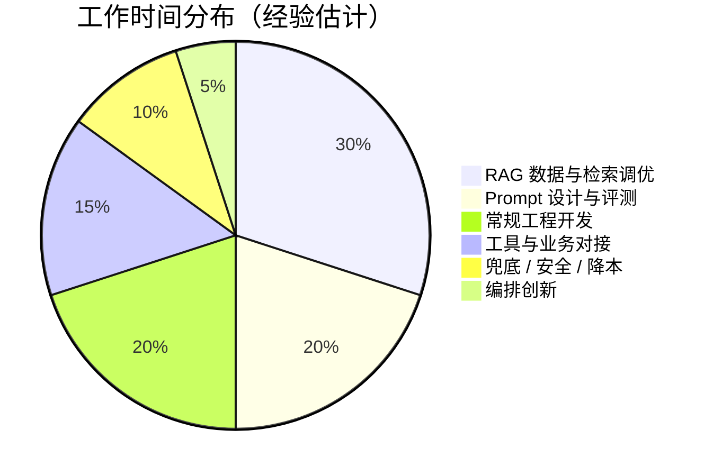

# 国内岗位地图

> 基于数百份公开 JD 的横向对比（大厂 / 科研院所 / 创业公司）。量级判断可靠，具体以你求职时行情为准。

## 三条线：先选对赛道

| 线 | JD 关键词 | 门槛 | 前端可行性 |
|---|---|---|---|
| 算法研究 | PyTorch / 训练 / 微调 / 论文 | 硕士+ | ❌ 别浪费时间 |
| 平台基建 | vLLM / GPU 调度 / K8s | 本科+偏系统 | ⚠️ 有基建经验再说 |
| **应用开发** | **LangChain / Dify / RAG / FC** | **本科+，重落地** | ✅ **主攻这里** |

> 国内大部分空缺在应用线——模型是少数大厂的战场，"把模型包进业务"的需求遍地都是。

## 应用岗的一天（时间去向）

> 一句话：**用工程手段，把一个不确定的智能组件，包装成确定可交付的产品。**
> 前半句是你的存量能力，后半句是转岗要补的。

## JD 真相表

| JD 写的 | 真相还是许愿 |
|---|---|
| Python（必备） | ✅ 真相，但深度要求低于后端岗 |
| "精通 LangChain/Dify" | ⚠️ 许愿——面试考的是机制理解，不是 API 背诵 |
| RAG / FC / 多智能体 / Prompt | ✅ 真相，**RAG 经验最实** |
| MCP | 🆕 2026 起快速上升，会写 Server 是差异化加分 |
| 微调经验 | ⚠️ 基本总在"加分"栏，应用线非硬门槛 |
| React/Vue 全栈 | ✅ 真香的加分项——团队就缺能一个人做完交互层的 |

**30 秒识别蹭热点岗**：JD 有 PyTorch/训练 → 算法线，划走；只有"LLM"没有 RAG/编排/落地 → 普通开发岗换了皮。

## 面试四大件

| 考什么 | 标准追问 | 你的准备口径 |
|---|---|---|
| **RAG 全链路** | "切块怎么切？检索不准怎么排查？怎么评估？" | 切块策略 → 混合检索/rerank → 评测集与指标 |
| **工具调用机制** | "工具执行失败模型怎么办？" | 完整循环讲清 + 错误回填与重试 |
| **幻觉治理** | "怎么防胡说？" | 分层：检索约束→引用溯源→输出校验→人工兜底 |
| **项目深挖** | "为什么这么选型？" | 讲取舍与踩坑，不是讲 demo |

**答不出"怎么评估效果"的人，会被归类为只会跑 demo。**

## 前端的牌

| 你的优势 | 直接变现处 |
|---|---|
| 全栈交付 | Agent 的交互层（流式 UI / 会话状态 / 调试面板）就是前端 |
| 接口设计直觉 | 工具调用 = 给模型设计 API；类型思维 → 结构化输出 |
| 工程审美 | 加载态 / 降级 / 错误处理，纯 Python 背景的盲区 |

| 短板 | 补法 |
|---|---|
| Python 熟练度 | 语法速查 + 实战中补到"够用" |
| 评测思维 | 前端测试是确定性的，Agent 评测是统计式的——专门练 |
| 模型体感 | 没捷径，只能实操喂出来 |

→ 行动方案：[前端转岗 90 天路线](/guides/agent-guide/roadmap-90d)
