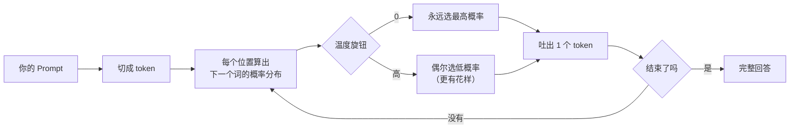

# LLM 原理 3 分钟

> 一张图 + 一个旋钮 + 一条推论。不讲数学。

## 全部原理就这条流水线

记住三个要点：

1. **逐 token 生成**——你看到的"流式输出"不是网速快，是它本来就是一个字一个字长出来的
2. **每次选择都是概率**——所以同一问题两个答案不是 bug，是机制
3. **它没有"查资料"这个动作**——每个字都是从概率里"续写"出来的，事实性没有任何保证

## 一条重要推论：幻觉为什么必然

> 模型是续写机器，不是查询机器。
> 你问它不知道的事，它不会返回 404，它会**续写一个格式完美的答案**。

| 你问 | 它的内在动作 | 结果 |
|---|---|---|
| "JS 是什么" | 训练里见过一万次 | 答得好 |
| "我们公司报销流程" | 没见过 → 续写一个"像样的" | **一本正经胡说** |
| "19.7 × 24.3" | 逐字续写数字 | 大概率算错 |

对号入座三个解法：**私有知识 → RAG**（先检索再答）；**精确计算 → 工具调用**（交给代码）；**要引用 → 强制溯源**（只准基于检索结果回答）。

## 温度就是唯一的"创意旋钮"

| | 温度 0 | 温度高 |
|---|---|---|
| 行为 | 永远选最稳的词 | 给冷门词机会 |
| 用在 | 代码 / JSON / 分类 | 文案 / 起名 |
| 常见坑 | 以为 = 确定性（≠，仍有微小抖动） | 以为更聪明（只是更跳） |

## 推理模型：先打草稿的一类

| | 普通模型（V3 / 4o） | 推理模型（R1 / o 系列） |
|---|---|---|
| 打草稿 | ❌ 脱口而出 | ✅ 先生成思维链 |
| 贵/慢 | 便宜快 | 贵且慢 |
| 值得用 | 抽取/分类/改写 | 多步推理/复杂调试/方案比选 |

工程上常见做法：**普通模型当路由，难题升级给推理模型**。

→ 账单和窗口的直觉：[上下文与账单](/guides/agent-guide/context-bill)
