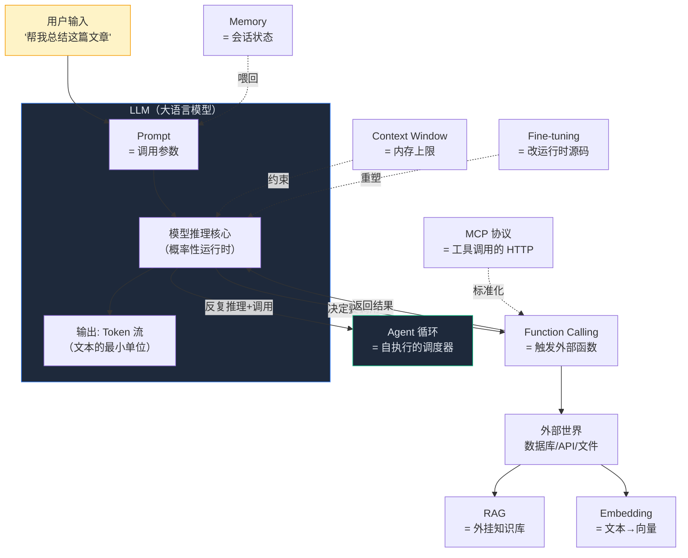
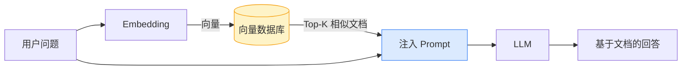
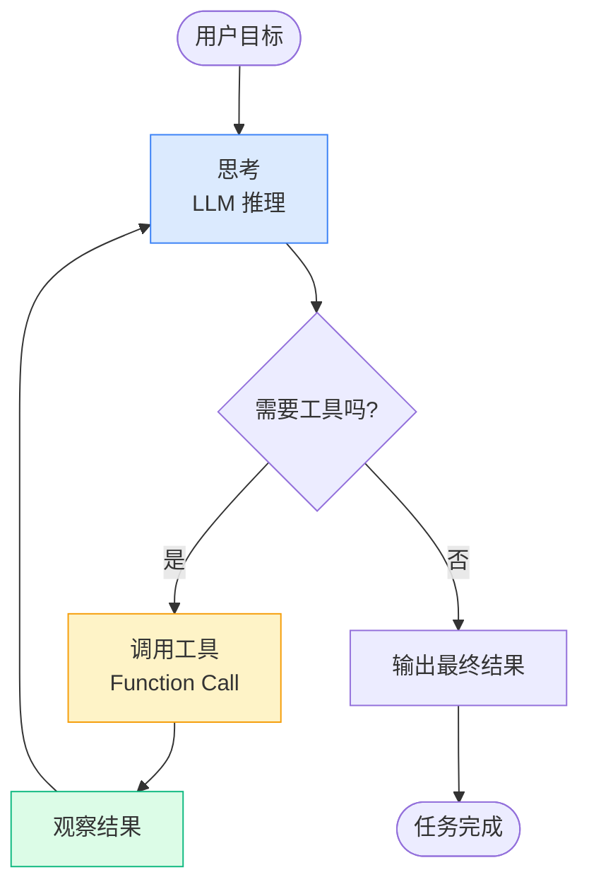
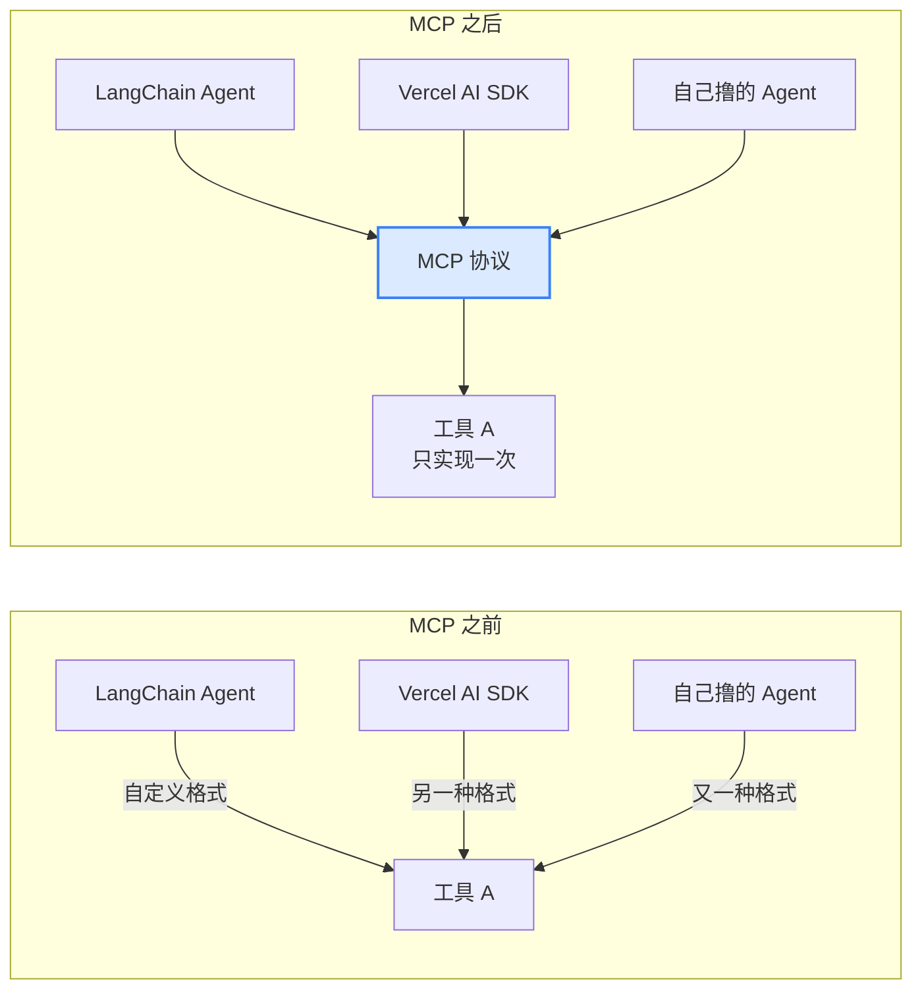

# Phase 0 · 术语地基

> 本篇是《前端工程师转型 Agent 开发指南》的第 0 阶段。
> 预计阅读 25 分钟，但**不需要一次读完**——它的真正用途是"工具书"：当你后面章节遇到看不懂的词，随时回来查。

---

## 先说句实在话

我至今记得自己第一次打开 LangChain 文档的那个晚上。前两屏就出现了 `Token`、`Embedding`、`ReAct`、`MCP`——每个词单独看好像都能猜出点意思，但凑在一起，我完全不知道作者在讲什么。我硬着头皮往下翻，跳过一堆术语，照着示例复制粘贴，居然跑通了；那一刻我很兴奋，觉得自己"入门了"。第二天换了个 prompt，结果整个程序跑出完全不一样的东西，我又跌回了原点。

后来我才意识到：**问题不在我的代码能力，问题在我没有词汇表。** 这堆术语不是装饰，它们是 Agent 开发者的"共用协议"——你不知道这些词，就听不懂别人在说什么；你只会照抄示例，但不知道每个参数为什么这么填。那一晚我合上电脑，下定决心先**把术语搞懂**，而不是再调一个 demo。

所以这一章不是"学前班"，它是整份指南的**地基**。我把它放在最前面，是因为我希望你少走我那条弯路。读完它，你不会立刻能写 Agent，但你会**听懂任何 Agent 相关的对话**——这是后面所有章节的前提。

---

## 本章你将解决什么

读完这一章，你应该能：

- 在阅读任何 Agent 相关文章时，**不再被术语劝退**
- 理解 11 个高频核心词的**严格定义**（不是只靠类比糊弄过去）
- 在脑中建立一张**术语关系图**，知道哪个词服务于哪个目的
- 用前端工程师熟悉的概念**作为脚手架**，加速理解

> 前置知识：能看懂 JavaScript / TypeScript，知道 HTTP 请求是什么。就这些。

---

## 为什么这一章必须先读

术语不是装饰，是**工程沟通的底层协议**。当同事说"这个需求要加 RAG"、"上线前必须做 Eval"、"用 Function Calling 不要 hardcode"，你要能立刻理解他在说什么。

这一章的目标，是让你**在读后续章节和任何 Agent 相关资料时，不被词汇卡住**。深入到代码层面，是后面几章的事。

<figure>
  <svg xmlns="http://www.w3.org/2000/svg" viewBox="0 0 800 280" role="img" aria-label="Agent 术语三层架构图">
    <defs>
      <linearGradient id="layerGrad" x1="0" y1="0" x2="1" y2="0">
        <stop offset="0" stop-color="#3b82f6"/>
        <stop offset="1" stop-color="#10b981"/>
      </linearGradient>
      <linearGradient id="layerGradV" x1="0" y1="0" x2="0" y2="1">
        <stop offset="0" stop-color="#3b82f6" stop-opacity="0.25"/>
        <stop offset="1" stop-color="#10b981" stop-opacity="0.25"/>
      </linearGradient>
    </defs>
    <rect width="800" height="280" rx="16" fill="#0f172a"/>
    <text x="400" y="38" text-anchor="middle" font-family="ui-sans-serif,system-ui,sans-serif" font-size="18" font-weight="700" fill="#e2e8f0">Agent 术语 · 三层认知架构</text>
    <text x="400" y="58" text-anchor="middle" font-family="ui-sans-serif,system-ui" font-size="11" fill="#64748b">每一层对应 Agent 开发的一个职责切面，按学习顺序递进</text>
    <rect x="40" y="78" width="720" height="46" rx="8" fill="#1e293b" stroke="url(#layerGrad)" stroke-width="1.5"/>
    <text x="60" y="98" font-family="ui-sans-serif,system-ui" font-size="12" font-weight="700" fill="#60a5fa">① 输入侧</text>
    <text x="60" y="116" font-family="ui-sans-serif,system-ui" font-size="10" fill="#94a3b8">你给模型什么</text>
    <rect x="200" y="86" width="120" height="30" rx="6" fill="#0f172a" stroke="#3b82f6"/>
    <text x="260" y="105" text-anchor="middle" font-family="ui-sans-serif,system-ui" font-size="11" fill="#cbd5e1">Prompt</text>
    <rect x="330" y="86" width="120" height="30" rx="6" fill="#0f172a" stroke="#3b82f6"/>
    <text x="390" y="105" text-anchor="middle" font-family="ui-sans-serif,system-ui" font-size="11" fill="#cbd5e1">Token</text>
    <rect x="460" y="86" width="140" height="30" rx="6" fill="#0f172a" stroke="#3b82f6"/>
    <text x="530" y="105" text-anchor="middle" font-family="ui-sans-serif,system-ui" font-size="11" fill="#cbd5e1">Context Window</text>
    <rect x="610" y="86" width="120" height="30" rx="6" fill="#0f172a" stroke="#3b82f6"/>
    <text x="670" y="105" text-anchor="middle" font-family="ui-sans-serif,system-ui" font-size="11" fill="#cbd5e1">LLM</text>
    <rect x="40" y="134" width="720" height="46" rx="8" fill="#1e293b" stroke="url(#layerGrad)" stroke-width="1.5"/>
    <text x="60" y="154" font-family="ui-sans-serif,system-ui" font-size="12" font-weight="700" fill="#a78bfa">② 能力扩展</text>
    <text x="60" y="172" font-family="ui-sans-serif,system-ui" font-size="10" fill="#94a3b8">模型如何接触外部世界</text>
    <rect x="240" y="142" width="180" height="30" rx="6" fill="#0f172a" stroke="#a78bfa"/>
    <text x="330" y="161" text-anchor="middle" font-family="ui-sans-serif,system-ui" font-size="11" fill="#cbd5e1">Function Calling</text>
    <rect x="430" y="142" width="140" height="30" rx="6" fill="#0f172a" stroke="#a78bfa"/>
    <text x="500" y="161" text-anchor="middle" font-family="ui-sans-serif,system-ui" font-size="11" fill="#cbd5e1">Embedding</text>
    <rect x="580" y="142" width="120" height="30" rx="6" fill="#0f172a" stroke="#a78bfa"/>
    <text x="640" y="161" text-anchor="middle" font-family="ui-sans-serif,system-ui" font-size="11" fill="#cbd5e1">RAG</text>
    <rect x="40" y="190" width="720" height="46" rx="8" fill="#1e293b" stroke="url(#layerGrad)" stroke-width="1.5"/>
    <text x="60" y="210" font-family="ui-sans-serif,system-ui" font-size="12" font-weight="700" fill="#34d399">③ 系统级</text>
    <text x="60" y="228" font-family="ui-sans-serif,system-ui" font-size="10" fill="#94a3b8">单次调用 → 自主系统</text>
    <rect x="210" y="198" width="100" height="30" rx="6" fill="#0f172a" stroke="#10b981"/>
    <text x="260" y="217" text-anchor="middle" font-family="ui-sans-serif,system-ui" font-size="11" fill="#cbd5e1">Agent</text>
    <rect x="320" y="198" width="100" height="30" rx="6" fill="#0f172a" stroke="#10b981"/>
    <text x="370" y="217" text-anchor="middle" font-family="ui-sans-serif,system-ui" font-size="11" fill="#cbd5e1">ReAct</text>
    <rect x="430" y="198" width="100" height="30" rx="6" fill="#0f172a" stroke="#10b981"/>
    <text x="480" y="217" text-anchor="middle" font-family="ui-sans-serif,system-ui" font-size="11" fill="#cbd5e1">MCP</text>
    <rect x="540" y="198" width="160" height="30" rx="6" fill="#0f172a" stroke="#10b981"/>
    <text x="620" y="217" text-anchor="middle" font-family="ui-sans-serif,system-ui" font-size="11" fill="#cbd5e1">Fine-tuning</text>
    <text x="400" y="262" text-anchor="middle" font-family="ui-sans-serif,system-ui" font-size="11" fill="#64748b">学完第①层能跑通单次调用 · 学完第②层会调工具 · 学完第③层才算懂 Agent</text>
  </svg>
  <figcaption>三层分类的真正用途：把"一堆名词"变成"三个递进的工作场景"</figcaption>
</figure>

---

## 全景概念图：这些词是怎么连起来的

先别背定义，看一张图。理解了"每个词在系统里扮演什么角色"，背起来会快十倍。



记住一句话：**Prompt 是输入，LLM 是引擎，Token 是燃料，Context Window 是油箱，Function Calling 是轮子，Agent 是方向盘**。剩下的词都是这六个的"辅助系统"。

---

## 核心术语详解

下面 11 个术语按**认知顺序**排列，不是字母序。请尽量按顺序读第一遍，后面回查时可以直接跳。

### 为什么按"三层"分类（不是字母序，也不是按重要性）

学一份新领域的术语表，最大的坑是"**背了一堆词，但不知道它们之间什么关系**"。本指南把 11 个术语分成三层，每一层对应 Agent 系统的一个**职责切面**：

- **输入侧（你给模型什么）**：`Prompt` · `Token` · `Context Window` · `LLM`
- **能力扩展（模型如何接触外部世界）**：`Function Calling` · `Embedding` · `RAG`
- **系统级（如何把单次调用变成自主系统）**：`Agent` · `ReAct` · `MCP` · `Fine-tuning`

**为什么这样切**：因为 Agent 开发的真实工作流就是按这三层递进的——先理解"输入是什么"，再学"怎么扩展模型能力"，最后才到"怎么把它装进一个自主系统"。学完第一层你能跑通单次 LLM 调用；学完第二层你能做工具调用和 RAG；学完第三层你才算"懂 Agent"。

### 核心术语 vs 扩展术语（精力分配建议）

这 11 个词不必平均用力。分成两组：

**核心 6 个**（必学，对应 80% 日常工作）：
1. **LLM** · 2. **Token** · 3. **Context Window** · 4. **Prompt** · 7. **Function Calling** · 8. **Agent**

**扩展 5 个**（先了解存在即可，深入放到后续章节）：
5. **Embedding** · 6. **RAG** · 9. **ReAct** · 10. **MCP** · 11. **Fine-tuning**

扩展术语的章节里会标注 "→ 深入见 Phase X"，第一次读可以只看"严格定义"和"一句话理解"，跳过代码示例。

---

### 1. LLM（Large Language Model，大语言模型）· 核心

**严格定义**：一种基于 Transformer 架构的神经网络，通过在海量文本上做"下一个 token 预测"训练，习得了对自然语言的统计性理解与生成能力。它本质上是一个**概率函数**：给定输入文本序列，输出下一个 token 的概率分布。

注意"概率"二字——这是它与所有传统程序最大的区别。同一个输入，它可能给出不同的输出（即使关掉随机采样，内部计算也是浮点概率，不是 if/else）。

> **前端类比**：把 LLM 想成"一个会用自然语言执行指令的运行时"。你的 `V8 引擎`执行 JavaScript，LLM 执行"自然语言伪代码"。但 V8 是确定性的，`1+1` 永远等于 2；LLM 是概率性的，"总结这段话"每次结果都不一样。

> **一句话理解**：LLM 是一个把自然语言映射到自然语言的函数，输出是概率分布，不是确定结果。

```typescript
// 前端思维：你习惯的函数
function add(a: number, b: number): number {
  return a + b  // 永远确定
}

// LLM 思维：你将要习惯的"函数"
async function summarize(text: string): Promise<string> {
  // 同样的 text，每次调用返回可能不同
  return await llm.complete(`请总结：${text}`)
}
```

---

### 2. Token（令牌）· 核心

**严格定义**：LLM 处理文本的最小单位。它**不是字符，也不是词**，而是介于两者之间的一种切分单元，由模型使用的 tokenizer（分词器）决定。一个英文单词通常是 1 个 token，一个常见中文汉字通常占 1-2 个 token（因为大部分模型词表对中文支持不如英文密集）。

Token 是**计费的单位**，也是 **Context Window 的计量单位**。不理解 token，就没法估算成本和上下文限制。

> **前端类比**：对前端来说，`'hello'.length === 5`，因为按字符计。对 LLM 来说，`tokenCount('hello') === 1`，因为按词元计。**字符数 ≠ token 数**，这是初学者最容易踩的坑。

> **一句话理解**：Token 是 LLM 的"字节"——既是你塞进模型的原料，也是模型吐出来的产物，还是账单上的数字。

<figure>
  <svg xmlns="http://www.w3.org/2000/svg" viewBox="0 0 800 320" role="img" aria-label="字符数 vs Token 数直观对比">
    <defs>
      <linearGradient id="tokG" x1="0" y1="0" x2="1" y2="0">
        <stop offset="0" stop-color="#3b82f6"/>
        <stop offset="1" stop-color="#10b981"/>
      </linearGradient>
    </defs>
    <rect width="800" height="320" rx="16" fill="#0f172a"/>
    <text x="400" y="36" text-anchor="middle" font-family="ui-sans-serif,system-ui,sans-serif" font-size="18" font-weight="700" fill="#e2e8f0">同一个词，两种计量单位</text>
    <text x="105" y="72" text-anchor="middle" font-family="ui-sans-serif,system-ui" font-size="12" font-weight="700" fill="#94a3b8">字符视角（前端习惯）</text>
    <text x="555" y="72" text-anchor="middle" font-family="ui-sans-serif,system-ui" font-size="12" font-weight="700" fill="#60a5fa">Token 视角（LLM 实际）</text>
    <text x="105" y="108" text-anchor="middle" font-family="ui-monospace,monospace" font-size="20" font-weight="700" fill="#e2e8f0">hamburger</text>
    <text x="555" y="108" text-anchor="middle" font-family="ui-monospace,monospace" font-size="20" font-weight="700" fill="#e2e8f0">hamburger</text>
    <g font-family="ui-monospace,monospace" font-size="13" fill="#cbd5e1">
      <rect x="35" y="130" width="14" height="22" rx="2" fill="#1e293b" stroke="#475569"/>
      <rect x="51" y="130" width="14" height="22" rx="2" fill="#1e293b" stroke="#475569"/>
      <rect x="67" y="130" width="14" height="22" rx="2" fill="#1e293b" stroke="#475569"/>
      <rect x="83" y="130" width="14" height="22" rx="2" fill="#1e293b" stroke="#475569"/>
      <rect x="99" y="130" width="14" height="22" rx="2" fill="#1e293b" stroke="#475569"/>
      <rect x="115" y="130" width="14" height="22" rx="2" fill="#1e293b" stroke="#475569"/>
      <rect x="131" y="130" width="14" height="22" rx="2" fill="#1e293b" stroke="#475569"/>
      <rect x="147" y="130" width="14" height="22" rx="2" fill="#1e293b" stroke="#475569"/>
      <rect x="163" y="130" width="14" height="22" rx="2" fill="#1e293b" stroke="#475569"/>
    </g>
    <text x="105" y="172" text-anchor="middle" font-family="ui-sans-serif,system-ui" font-size="13" fill="#94a3b8">9 个字符（.length === 9）</text>
    <g font-family="ui-monospace,monospace" font-size="14" fill="#e2e8f0">
      <rect x="465" y="128" width="70" height="26" rx="4" fill="#0f172a" stroke="url(#tokG)" stroke-width="2"/>
      <text x="500" y="146" text-anchor="middle">ham</text>
      <rect x="540" y="128" width="110" height="26" rx="4" fill="#0f172a" stroke="url(#tokG)" stroke-width="2"/>
      <text x="595" y="146" text-anchor="middle">burger</text>
    </g>
    <text x="555" y="172" text-anchor="middle" font-family="ui-sans-serif,system-ui" font-size="13" fill="#60a5fa">2 个 token（ham + burger）</text>
    <line x1="40" y1="196" x2="760" y2="196" stroke="#1e293b" stroke-width="1"/>
    <text x="105" y="222" text-anchor="middle" font-family="ui-monospace,monospace" font-size="18" font-weight="700" fill="#e2e8f0">你好世界</text>
    <text x="555" y="222" text-anchor="middle" font-family="ui-monospace,monospace" font-size="18" font-weight="700" fill="#e2e8f0">你好世界</text>
    <text x="105" y="252" text-anchor="middle" font-family="ui-sans-serif,system-ui" font-size="13" fill="#94a3b8">4 个字符</text>
    <g font-family="ui-monospace,monospace" font-size="13" fill="#e2e8f0">
      <rect x="455" y="236" width="40" height="24" rx="4" fill="#0f172a" stroke="url(#tokG)" stroke-width="2"/>
      <text x="475" y="253" text-anchor="middle">你</text>
      <rect x="500" y="236" width="40" height="24" rx="4" fill="#0f172a" stroke="url(#tokG)" stroke-width="2"/>
      <text x="520" y="253" text-anchor="middle">好</text>
      <rect x="545" y="236" width="40" height="24" rx="4" fill="#0f172a" stroke="url(#tokG)" stroke-width="2"/>
      <text x="565" y="253" text-anchor="middle">世</text>
      <rect x="590" y="236" width="40" height="24" rx="4" fill="#0f172a" stroke="url(#tokG)" stroke-width="2"/>
      <text x="610" y="253" text-anchor="middle">界</text>
    </g>
    <text x="555" y="278" text-anchor="middle" font-family="ui-sans-serif,system-ui" font-size="13" fill="#60a5fa">≈ 6-8 个 token（中文按字切，每字 1-2 token）</text>
    <text x="400" y="306" text-anchor="middle" font-family="ui-sans-serif,system-ui" font-size="11" fill="#64748b">估算经验：1 英文词 ≈ 1 token · 1 中文字 ≈ 1.5-2 token · 1 个 emoji ≈ 2-3 token</text>
  </svg>
  <figcaption>Token 不是字符也不是单词——它是分词器（tokenizer）决定的"语义原子"</figcaption>
</figure>

```typescript
// OpenAI 的 tokenizer 大致这样工作（实际更复杂）
// 英文：1 word ≈ 1 token
"hamburger"   // → ["ham", "burger"]  = 2 tokens
"hello"       // → ["hello"]          = 1 token

// 中文：1 char ≈ 1~2 tokens（取决于模型）
"你好"        // → ["你", "好"]        ≈ 2-3 tokens
"人工智能"    // → 可能 4-6 tokens
```

> **实战提醒**：估算成本时，**1 个中文字符 ≈ 1.5-2 个 token**。一篇 5000 字的中文博客 ≈ 7500-10000 tokens。这是你做成本预算的基础换算。

---

### 3. Context Window（上下文窗口）· 核心

**严格定义**：LLM 在**单次推理**中能够接收的输入 token + 输出 token 的**总长度上限**。超出这个上限的内容会被截断或报错。这是模型架构层面的硬限制，不是 API 限制。

不同模型差异巨大：早期 GPT-3 是 2K，GPT-4 Turbo 是 128K，Claude 3.5 是 200K，Gemini 1.5 Pro 是 1M。窗口越大，越能处理长文档，但**不一定更聪明**——长窗口中的"中段内容"容易被忽略（称为 "lost in the middle" 问题）。

> **前端类比**：`Context Window` = JavaScript 的 `Number.MAX_SAFE_INTEGER`，是一个运行时硬上限。或者更形象：它是 LLM 的"内存条"——你能一次性塞进去的所有信息总量。`Memory`（下面会讲）则是你**主动管理**的那部分内存。

> **一句话理解**：Context Window 决定"模型一次能看多少东西"，超出就要靠 RAG 或 Memory 来裁剪。

```typescript
// 你写前端时的内存约束思维
const MAX_PAYLOAD = 128 * 1024  // 128KB 请求体上限

// 写 Agent 时的上下文约束思维
const CONTEXT_WINDOW = 128_000  // 128K tokens
// 用户问题 + 历史对话 + RAG 注入的资料 + 系统提示 + 输出预留
// 五个部分共享这 128K，必须主动管理
```

---

### 4. Prompt（提示词）· 核心

**严格定义**：开发者或用户**输入给 LLM 的完整文本**，包含指令、上下文、示例、问题等所有信息。Prompt 是 LLM 唯一的"入参"——所有控制手段（角色设定、输出格式、行为约束）最终都要通过自然语言写进 Prompt。

Prompt 不是"咒语"，它是一门**不精确的接口设计**。好的 Prompt 像好的 API 文档：清晰、有示例、有边界。

> **前端类比**：`Prompt` = 一个函数的**入参对象**，但它用自然语言书写。你以前写 `getUser({ id: 1, fields: ['name'] })`，现在写 "请返回 id 为 1 的用户，只要 name 字段"。Prompt 工程 ≈ 接口设计 + 文档撰写。

> **一句话理解**：Prompt 是 LLM 唯一的入参格式，所有控制权都在你怎么写它。

```typescript
// 前端的 API 调用
fetch('/api/summarize', {
  body: JSON.stringify({
    text: article,
    maxLength: 100,
    tone: 'professional',
  })
})

// 对应的 Prompt（同样的入参，但用自然语言描述）
const prompt = `
你是专业编辑。请总结以下文章：
- 字数不超过 100 字
- 语气保持专业
- 只输出总结，不要解释

【文章开始】
${article}
【文章结束】
`
```

---

### 5. Embedding（嵌入向量）· 扩展（→ 深入见 Phase 5 · RAG）

**严格定义**：把任意长度的文本（或图像、音频）通过一个专门模型，映射成一个**固定长度的浮点数向量**（通常是 768、1536 或 3072 维）。这个向量的核心特性是：**语义相近的文本，向量也相近**。于是"语义相似度"就被转化为"向量距离"（余弦相似度等），变成了可计算问题。

Embedding 是几乎所有"语义搜索"、"推荐"、"RAG"系统的基础。

> **前端类比**：`Embedding` = 一个 `hash` 函数，但它不是均匀分布的，而是**保语义的**——意义相近的输入产生相近的输出。或者说：它是把一段文字"序列化"成一个数字数组，让电脑能算两段文字"有多像"。

> **一句话理解**：Embedding 把"语义"变成"坐标"，让相似度变成距离，让搜索变成数学。

```typescript
// 前端熟悉的"相似度"是字符串层面的
"hello".includes("hell")  // true，但只是字符匹配

// Embedding 给你"语义层面"的相似度
const vec1 = await embed("猫在沙发上睡觉")   // [0.12, -0.34, ...] 1536 维
const vec2 = await embed("小猫卧在客厅的沙发") // [0.11, -0.33, ...]
const vec3 = await embed("今天股市大涨")

cosineSimilarity(vec1, vec2)  // ≈ 0.91  语义高度相似
cosineSimilarity(vec1, vec3)  // ≈ 0.12  语义几乎无关
```

---

### 6. RAG（Retrieval-Augmented Generation，检索增强生成）· 扩展（→ 深入见 Phase 5 · RAG）

**严格定义**：一种架构模式，在 LLM 生成回答**之前**，先从一个外部知识库（通常是向量数据库）中**检索**出与用户问题最相关的文档片段，然后把这些片段**注入到 Prompt** 中，让 LLM 基于检索到的资料作答。

RAG 解决三个问题：(1) 模型训练数据有截止时间，不知道最新信息；(2) 模型不知道你的私有数据；(3) 直接把所有资料塞进 Context Window 太贵也塞不下。

> **前端类比**：`RAG` = 给 LLM 配了一个 `CDN 缓存层`。LLM 本体是"中心服务器"，但每次回答前先去"边缘缓存"（向量库）取最新最相关的数据，再合成响应。没有 RAG，模型只能用它出厂时的"源码"回答；有了 RAG，它能用到"运行时数据"。

> **一句话理解**：RAG = 搜索 + LLM 生成。先从你的资料库里搜出几段，再让模型基于这些段回答，避免它"瞎编"。



---

### 7. Function Calling / Tool Use（函数调用 / 工具使用）· 核心

**严格定义**：一种 LLM 与外部代码集成的**协议**。开发者预先定义一组"工具"（每个工具有名字、描述、参数 schema），LLM 在推理过程中**可以决定**调用某个工具，并输出结构化的调用参数（通常是 JSON）。开发者拿到参数后**真正执行**这个函数，再把结果返回给 LLM 继续推理。

关键点：**LLM 自己不执行任何代码，它只是"建议"要调用什么**。真正执行的是你的程序。这是一种安全设计，也是能力设计——LLM 的"权限边界"完全由你的代码决定。

这是初学者第二个最容易混淆的点——以为是"LLM 直接调用了我的函数"。**没有，它只是输出了一份调用建议**，决定要不要执行、怎么执行，完全在你的代码里。

<figure>
  <svg xmlns="http://www.w3.org/2000/svg" viewBox="0 0 800 320" role="img" aria-label="Function Calling 谁思考谁执行时序图">
    <defs>
      <linearGradient id="fcGrad" x1="0" y1="0" x2="1" y2="0">
        <stop offset="0" stop-color="#3b82f6"/>
        <stop offset="1" stop-color="#10b981"/>
      </linearGradient>
      <marker id="fcArr" markerWidth="10" markerHeight="10" refX="8" refY="3" orient="auto" markerUnits="strokeWidth">
        <path d="M0,0 L0,6 L9,3 z" fill="#94a3b8"/>
      </marker>
      <marker id="fcArrB" markerWidth="10" markerHeight="10" refX="8" refY="3" orient="auto" markerUnits="strokeWidth">
        <path d="M0,0 L0,6 L9,3 z" fill="#60a5fa"/>
      </marker>
    </defs>
    <rect width="800" height="320" rx="16" fill="#0f172a"/>
    <text x="400" y="36" text-anchor="middle" font-family="ui-sans-serif,system-ui,sans-serif" font-size="18" font-weight="700" fill="#e2e8f0">Function Calling · 谁思考，谁执行？</text>
    <rect x="80" y="62" width="200" height="36" rx="8" fill="#1e293b" stroke="#a78bfa"/>
    <text x="180" y="85" text-anchor="middle" font-family="ui-sans-serif,system-ui" font-size="13" font-weight="600" fill="#c4b5fd">LLM（大脑）</text>
    <rect x="520" y="62" width="200" height="36" rx="8" fill="#1e293b" stroke="#34d399"/>
    <text x="620" y="85" text-anchor="middle" font-family="ui-sans-serif,system-ui" font-size="13" font-weight="600" fill="#6ee7b7">你的代码（手脚）</text>
    <line x1="180" y1="98" x2="180" y2="280" stroke="#334155" stroke-width="1" stroke-dasharray="3,3"/>
    <line x1="620" y1="98" x2="620" y2="280" stroke="#334155" stroke-width="1" stroke-dasharray="3,3"/>
    <text x="30" y="128" font-family="ui-sans-serif,system-ui" font-size="11" fill="#64748b">①</text>
    <line x1="190" y1="124" x2="610" y2="124" stroke="#94a3b8" stroke-width="2" marker-end="url(#fcArr)"/>
    <text x="400" y="118" text-anchor="middle" font-family="ui-sans-serif,system-ui" font-size="11" fill="#94a3b8">用户问题 + 工具清单</text>
    <text x="400" y="138" text-anchor="middle" font-family="ui-sans-serif,system-ui" font-size="10" fill="#64748b">（你的代码先注册工具）</text>
    <text x="30" y="168" font-family="ui-sans-serif,system-ui" font-size="11" fill="#64748b">②</text>
    <line x1="610" y1="164" x2="190" y2="164" stroke="#60a5fa" stroke-width="2" marker-end="url(#fcArrB)"/>
    <text x="400" y="158" text-anchor="middle" font-family="ui-sans-serif,system-ui" font-size="11" font-weight="600" fill="#60a5fa">"我建议调用 get_weather(杭州)"</text>
    <text x="400" y="178" text-anchor="middle" font-family="ui-sans-serif,system-ui" font-size="10" fill="#64748b">（LLM 只输出 JSON 建议，不执行）</text>
    <text x="30" y="214" font-family="ui-sans-serif,system-ui" font-size="11" fill="#64748b">③</text>
    <rect x="555" y="196" width="130" height="28" rx="6" fill="#064e3b" stroke="#10b981"/>
    <text x="620" y="214" text-anchor="middle" font-family="ui-sans-serif,system-ui" font-size="11" font-weight="600" fill="#6ee7b7">真正执行函数</text>
    <text x="620" y="238" text-anchor="middle" font-family="ui-monospace,monospace" font-size="10" fill="#94a3b8">await getWeather('杭州')</text>
    <text x="30" y="268" font-family="ui-sans-serif,system-ui" font-size="11" fill="#64748b">④</text>
    <line x1="610" y1="264" x2="190" y2="264" stroke="#34d399" stroke-width="2" marker-end="url(#fcArrB)"/>
    <text x="400" y="258" text-anchor="middle" font-family="ui-sans-serif,system-ui" font-size="11" font-weight="600" fill="#34d399">把执行结果送回 LLM</text>
    <text x="400" y="278" text-anchor="middle" font-family="ui-sans-serif,system-ui" font-size="10" fill="#64748b">（LLM 拿到结果，继续生成给用户的回答）</text>
    <text x="400" y="306" text-anchor="middle" font-family="ui-sans-serif,system-ui" font-size="12" fill="#e2e8f0">核心边界：<tspan fill="#a78bfa" font-weight="700">LLM 负责思考（决策）</tspan> · <tspan fill="#34d399" font-weight="700">你的代码负责执行（副作用）</tspan></text>
  </svg>
  <figcaption>Function Calling 的本质：LLM 是"调度员"，不是"操作员"——它发指令，你干活</figcaption>
</figure>

> **前端类比**：`Function Calling` = `addEventListener`。LLM 是"事件源"，它声明"我想触发 `search_weather` 这个事件"，你的代码就是"事件监听器"，决定要不要执行、怎么执行。LLM 永远不直接操作 DOM（外部世界），所有副作用都走你的回调。

> **一句话理解**：Function Calling 让 LLM 从"只会说话"变成"会调度外部能力"，但执行权永远在你的代码手里。

```typescript
// 1. 你先定义"工具"（类似声明一个事件）
const tools = [{
  name: "get_weather",
  description: "查询某城市天气",
  parameters: {
    type: "object",
    properties: {
      city: { type: "string", description: "城市名" }
    },
    required: ["city"]
  }
}]

// 2. LLM 看了对话后，"决定"调用，返回结构化参数
// LLM 输出 → { tool: "get_weather", args: { city: "杭州" } }

// 3. 你的代码真正执行（LLM 不能直接执行）
const result = await getWeather("杭州")

// 4. 把结果送回 LLM，它继续生成最终回复给用户
```

---

### 8. Agent（智能体）· 核心

**严格定义**：一个**以 LLM 为大脑、能自主决策调用工具、并通过观察工具结果循环推进任务**的系统。它不是单次 LLM 调用，而是一个**循环**：感知（接收输入）→ 推理（LLM 思考）→ 行动（调用工具）→ 观察（拿到结果）→ 再推理……直到任务完成或主动停止。

Agent 与"普通 LLM 调用"的本质区别是**自主性**：普通调用是你写好流程，LLM 只负责每一步的文本生成；Agent 是你给目标，LLM 自己决定下一步做什么。

> **前端类比**：`Agent` = 一个 `setTimeout`/`requestAnimationFrame` 循环，但**每一步要做什么由 LLM 决定**，不是你硬编码。普通 LLM 调用像"一次性事件处理函数"，Agent 像"自运行的游戏循环"。

> **一句话理解**：Agent = LLM + 循环 + 工具 + 自主决策。你给目标，它自己想怎么做。



---

### 9. ReAct（Reasoning + Acting）· 扩展（→ 深入见 Phase 6 · Agent 框架）

**严格定义**：目前**最主流的 Agent 推理范式**，由 Yao et al. 2022 提出。它要求 LLM 在每一步**显式输出三段**：
- **Thought**（思考）：我现在想到什么
- **Action**（行动）：我要调用什么工具
- **Observation**（观察）：工具返回了什么

然后再进入下一轮 Thought。这种"显式思考链"显著提升了 LLM 在复杂任务上的表现，因为**强制结构化推理**降低了幻觉和跳步。

绝大多数你能看到的"Agent 框架"（LangChain Agent、Vercel AI SDK 的 `streamText` + tools）底层都是 ReAct 或其变体。

> **前端类比**：`ReAct` = 给 LLM 强加了一套 `TDD 循环`——先写"我打算测什么"（Thought），再"执行测试"（Action），再"看断言结果"（Observation），循环往复。它把模糊的"思考"强制流水线化，减少 LLM 偷懒或乱跳。

> **一句话理解**：ReAct 是 Agent 的"标准算法"，强制 LLM 按 思考→行动→观察 循环，比让它自由发挥稳定得多。

```
# 一个典型的 ReAct 输出长这样

Thought: 用户问杭州明天天气。我需要查询天气 API。
Action: get_weather
Action Input: {"city": "杭州", "date": "2026-07-26"}
Observation: {"temp": 26, "weather": "多云转小雨"}
Thought: 我拿到了天气数据。可以回答用户了。
Final Answer: 杭州明天 26 度，多云转小雨，建议带伞。
```

---

### 10. MCP（Model Context Protocol，模型上下文协议）· 扩展（→ 深入见 Phase 4 · 工具调用四层栈）

**严格定义**：由 Anthropic 在 2024 年开源的**标准化协议**，规定了 LLM 应用（Client）与外部工具/数据源（Server）之间如何发现、描述、调用彼此的能力。你可以把它理解为"AI 时代的 USB-C 接口"——任何 Agent 只要说 MCP 协议，就能直接接任何 MCP Server 提供的工具，不用每接一个工具就改一次代码。

MCP 解决的是**集成碎片化问题**：在 MCP 之前，每个 Agent 框架的 Tool 定义格式都不同，工具方要为 N 个框架写 N 份适配。有了 MCP，工具方只需实现一份 MCP Server。

> **前端类比**：`MCP` = AI 工具调用界的 **RESTful 规范** 或 **GraphQL Schema**。在 REST 之前，每个后端接口风格各异；REST 之后，前端工程师换项目也能快速上手。MCP 之于 Agent 工具，就是这种"统一接口契约"。

> **一句话理解**：MCP 让 Agent 接工具变成"插 USB"，而不是"焊电路"。



---

### 11. Fine-tuning（微调）· 扩展（→ 深入见附录）

**严格定义**：在预训练模型的基础上，用一批**特定任务或领域的数据**继续训练模型的部分参数，使其在目标任务上表现更好。Fine-tuning **改变了模型本身的权重**，所以效果是"内化"的，不像 Prompt 或 RAG 那样只在推理时起作用。

它分多种级别：全参数微调（贵）、LoRA/QLoRA（便宜，只调少量参数）、Instruction Tuning（指令微调）等。

**重要认知**：90% 的场景**不需要 Fine-tuning**。优先级是：Prompt 优化 → RAG → Few-shot 示例 → 最后才考虑 Fine-tuning。新手最容易犯的错就是"我要让模型更懂我的业务，所以去微调"——99% 的情况下，RAG 就够了。

> **前端类比**：`Fine-tuning` = **改 V8 引擎源码**重新编译。代价大、不可逆、需要数据。而 `Prompt 优化` = 改你写的 JS 代码，`RAG` = 加运行时配置。正常业务永远优先用后两者，直到你确实需要"重塑运行时"。

> **一句话理解**：Fine-tuning 是"改模型源码"，成本高、不可逆；先用尽 Prompt + RAG + 示例，仍然不够再考虑它。

| 维度 | Prompt 优化 | RAG | Fine-tuning |
|------|------------|-----|-------------|
| 改变模型本体 | 否 | 否 | **是** |
| 需要训练数据 | 否 | 需要知识库 | **需要标注数据** |
| 单次成本 | 低 | 中（检索） | 高（训练） |
| 长期成本 | 低 | 中（存储） | 低（推理） |
| 适用场景 | 控制输出风格/格式 | 注入私有知识 | 改变基础能力/领域适配 |
| 优先级 | **1（首选）** | **2** | **3（最后）** |

---

## 术语对照速查表

复习时用这张表。**左列是 Agent 术语，中列是严格定义关键词，右列是前端类比**。三者都对上，才算真懂。

| 术语 | 严格定义关键词 | 前端类比 |
|------|---------------|---------|
| **LLM** | 概率性神经网络，下一 token 预测 | 自然语言版 V8 引擎 |
| **Token** | 模型处理文本的最小单位，非字符非词 | LLM 的"字节" |
| **Context Window** | 单次推理输入+输出的 token 上限 | LLM 的内存条 |
| **Prompt** | 输入给 LLM 的完整文本 | 函数入参（自然语言版） |
| **Embedding** | 文本→定长向量，保语义相似度 | 保语义的 hash 函数 |
| **RAG** | 检索+生成，先搜后答 | LLM 的 CDN 缓存层 |
| **Function Calling** | LLM 输出结构化调用参数，代码执行 | addEventListener |
| **Agent** | LLM + 循环 + 工具 + 自主决策 | 自运行的 setTimeout 循环 |
| **ReAct** | Thought→Action→Observation 标准范式 | TDD 循环 |
| **MCP** | 工具调用的标准化协议 | AI 版 RESTful |
| **Fine-tuning** | 用数据重塑模型权重 | 改 V8 源码重新编译 |

<figure>
  <svg xmlns="http://www.w3.org/2000/svg" viewBox="0 0 800 400" role="img" aria-label="11 个术语的关系全景图">
    <defs>
      <linearGradient id="panG" x1="0" y1="0" x2="1" y2="0">
        <stop offset="0" stop-color="#3b82f6"/>
        <stop offset="1" stop-color="#10b981"/>
      </linearGradient>
      <marker id="panArr" markerWidth="9" markerHeight="9" refX="7" refY="3" orient="auto" markerUnits="strokeWidth">
        <path d="M0,0 L0,6 L8,3 z" fill="#475569"/>
      </marker>
    </defs>
    <rect width="800" height="400" rx="16" fill="#0f172a"/>
    <text x="400" y="36" text-anchor="middle" font-family="ui-sans-serif,system-ui,sans-serif" font-size="18" font-weight="700" fill="#e2e8f0">11 个术语 · 谁服务谁</text>
    <text x="400" y="56" text-anchor="middle" font-family="ui-sans-serif,system-ui" font-size="11" fill="#64748b">中央是用户目标，三层术语像齿轮一样协作完成任务</text>
    <rect x="330" y="174" width="140" height="52" rx="10" fill="#1e293b" stroke="url(#panG)" stroke-width="2"/>
    <text x="400" y="198" text-anchor="middle" font-family="ui-sans-serif,system-ui" font-size="13" font-weight="700" fill="#e2e8f0">用户目标</text>
    <text x="400" y="216" text-anchor="middle" font-family="ui-sans-serif,system-ui" font-size="10" fill="#94a3b8">"帮我做 X"</text>
    <rect x="60" y="92" width="110" height="34" rx="6" fill="#1e293b" stroke="#3b82f6"/>
    <text x="115" y="113" text-anchor="middle" font-family="ui-sans-serif,system-ui" font-size="11" fill="#cbd5e1">Prompt</text>
    <rect x="190" y="92" width="110" height="34" rx="6" fill="#1e293b" stroke="#3b82f6"/>
    <text x="245" y="113" text-anchor="middle" font-family="ui-sans-serif,system-ui" font-size="11" fill="#cbd5e1">Token</text>
    <rect x="60" y="138" width="110" height="34" rx="6" fill="#1e293b" stroke="#3b82f6"/>
    <text x="115" y="159" text-anchor="middle" font-family="ui-sans-serif,system-ui" font-size="11" fill="#cbd5e1">Context Window</text>
    <rect x="190" y="138" width="110" height="34" rx="6" fill="#1e293b" stroke="#3b82f6" stroke-width="2"/>
    <text x="245" y="159" text-anchor="middle" font-family="ui-sans-serif,system-ui" font-size="11" font-weight="700" fill="#60a5fa">LLM ★</text>
    <text x="60" y="80" font-family="ui-sans-serif,system-ui" font-size="10" font-weight="700" fill="#3b82f6">① 输入侧</text>
    <line x1="170" y1="155" x2="328" y2="190" stroke="#475569" stroke-width="1.2" marker-end="url(#panArr)"/>
    <line x1="300" y1="109" x2="335" y2="180" stroke="#475569" stroke-width="1.2" marker-end="url(#panArr)"/>
    <rect x="350" y="92" width="100" height="34" rx="6" fill="#1e293b" stroke="#a78bfa"/>
    <text x="400" y="113" text-anchor="middle" font-family="ui-sans-serif,system-ui" font-size="11" fill="#cbd5e1">Embedding</text>
    <rect x="470" y="92" width="80" height="34" rx="6" fill="#1e293b" stroke="#a78bfa"/>
    <text x="510" y="113" text-anchor="middle" font-family="ui-sans-serif,system-ui" font-size="11" fill="#cbd5e1">RAG</text>
    <rect x="570" y="92" width="160" height="34" rx="6" fill="#1e293b" stroke="#a78bfa" stroke-width="2"/>
    <text x="650" y="113" text-anchor="middle" font-family="ui-sans-serif,system-ui" font-size="11" font-weight="700" fill="#c4b5fd">Function Calling ★</text>
    <text x="350" y="80" font-family="ui-sans-serif,system-ui" font-size="10" font-weight="700" fill="#a78bfa">② 能力扩展</text>
    <line x1="470" y1="126" x2="430" y2="172" stroke="#475569" stroke-width="1.2" marker-end="url(#panArr)"/>
    <line x1="650" y1="126" x2="460" y2="178" stroke="#475569" stroke-width="1.2" marker-end="url(#panArr)"/>
    <rect x="350" y="270" width="100" height="34" rx="6" fill="#1e293b" stroke="#10b981" stroke-width="2"/>
    <text x="400" y="291" text-anchor="middle" font-family="ui-sans-serif,system-ui" font-size="11" font-weight="700" fill="#6ee7b7">Agent ★</text>
    <rect x="180" y="270" width="90" height="34" rx="6" fill="#1e293b" stroke="#10b981"/>
    <text x="225" y="291" text-anchor="middle" font-family="ui-sans-serif,system-ui" font-size="11" fill="#cbd5e1">ReAct</text>
    <rect x="530" y="270" width="90" height="34" rx="6" fill="#1e293b" stroke="#10b981"/>
    <text x="575" y="291" text-anchor="middle" font-family="ui-sans-serif,system-ui" font-size="11" fill="#cbd5e1">MCP</text>
    <rect x="640" y="270" width="110" height="34" rx="6" fill="#1e293b" stroke="#10b981"/>
    <text x="695" y="291" text-anchor="middle" font-family="ui-sans-serif,system-ui" font-size="11" fill="#cbd5e1">Fine-tuning</text>
    <rect x="50" y="270" width="110" height="34" rx="6" fill="#1e293b" stroke="#f59e0b"/>
    <text x="105" y="291" text-anchor="middle" font-family="ui-sans-serif,system-ui" font-size="11" fill="#fbbf24">Memory（辅助）</text>
    <text x="350" y="258" font-family="ui-sans-serif,system-ui" font-size="10" font-weight="700" fill="#10b981">③ 系统级</text>
    <line x1="400" y1="226" x2="400" y2="268" stroke="#10b981" stroke-width="1.5" marker-end="url(#panArr)"/>
    <line x1="245" y1="270" x2="335" y2="232" stroke="#475569" stroke-width="1" stroke-dasharray="2,3"/>
    <line x1="575" y1="270" x2="465" y2="232" stroke="#475569" stroke-width="1" stroke-dasharray="2,3"/>
    <line x1="225" y1="304" x2="370" y2="304" stroke="#475569" stroke-width="1" stroke-dasharray="2,3"/>
    <line x1="510" y1="304" x2="450" y2="304" stroke="#475569" stroke-width="1" stroke-dasharray="2,3"/>
    <text x="400" y="350" text-anchor="middle" font-family="ui-sans-serif,system-ui" font-size="11" fill="#94a3b8">实线 = 主流程数据 · 虚线 = 辅助/可选关系 · ★ = 核心 6 词</text>
    <text x="400" y="372" text-anchor="middle" font-family="ui-sans-serif,system-ui" font-size="11" fill="#64748b">一句话总结：Prompt 喂 LLM · Function Calling 接外部 · Agent 把循环跑起来</text>
  </svg>
  <figcaption>别死记 11 个词——记住"3 层 + 6 颗星"，整张图就能自己画出来</figcaption>
</figure>

---

## 三个最容易踩的认知坑

> **坑 1：把 LLM 当数据库用**
> LLM 的训练知识在权重里，**不会更新**。问它"今天股价"，它要么瞎编要么说不知道。要实时数据，必须用 Function Calling 或 RAG。

> **坑 2：以为 Token 数 = 字符数**
> 计费、上下文限制都按 token 算。中文字符 ≈ 1.5-2 token。在做成本预算或截断逻辑时按字符算是常见 bug。

> **坑 3：一上来就想 Fine-tuning**
> 90% 的"模型不够懂业务"问题，RAG + 好 Prompt 就能解决。Fine-tuning 是最后选项，且数据量不够时反而会让模型退化。

---

## 本章检查清单

读完这一章，自测一下。能对每一条说出**为什么**，再进入下一章：

- [ ] 我能解释为什么 LLM 是"概率性"的，以及这对编程意味着什么
- [ ] 我知道 1000 个中文字大致消耗多少 token
- [ ] 我能区分 Context Window、Memory、RAG 三者的不同用途
- [ ] 我能说清 Function Calling 里"谁负责思考、谁负责执行"
- [ ] 我能解释 Agent 和普通 LLM 调用的本质区别
- [ ] 我知道 ReAct 的三个阶段是什么
- [ ] 我能说清 MCP 解决了什么问题
- [ ] 我知道 Fine-tuning 在优先级里排第几，为什么

---

## 下一步

术语地基打完了，接下来进入 **Phase 1 · 心智模型迁移**——讨论从"前端思维"切换到"Agent 思维"时，哪些根深蒂固的本能需要主动改写。

如果你现在就只想动手试试，可以**跳到 Phase 2**先跑通第一个 API 调用，回头再读 Phase 1。本指南的所有章节都**支持跳读**，不强求顺序。
