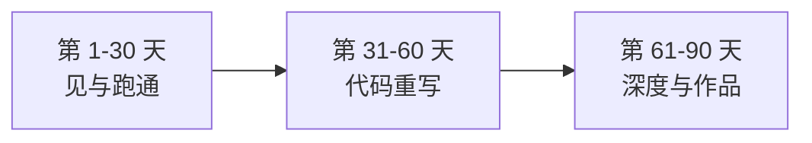

# 前端转岗 90 天路线

> 一张能力对照表 + 三段计划 + 简历公式。照着执行即可。

## 能力对照：你已有的 vs 要补的

| 岗位要求 | 前端存量 | 差距 | 补法 |
|---|---|---|---|
| Python | 语法思维（TS 迁移快） | 熟练度 | 速查表 + 实战写，2 周够用 |
| LLM API / Prompt | 接口直觉 | 体感 | 裸 SDK 调用 + 流式（1 周） |
| RAG | —— | **最大短板** | 平台做一遍 → 代码做一遍（3 周） |
| 工具调用 / MCP | **API 设计是强项** | 机制细节 | 写 1 个 FC 工具 + 1 个 MCP Server（1 周） |
| 框架（LangChain） | 组件化思维 | 生态熟悉度 | 重构一个真实项目（3 周） |
| 编排（LangGraph） | 状态管理直觉 | 图思维 | 一个多 Agent 工作流（2 周） |
| 评测 | ❌ 思维方式不同 | 统计式测试 | 每个项目都配评测集 |

> 右列总时长 ≈ 90 天业余时间。《Agent 实战》的章节顺序就是按这个差距表设计的。

## 90 天三段式

| 阶段 | 目标 | 产出物 |
|---|---|---|
| **1-30 天** 看见 | Dify 跑通对话/知识库/工作流；裸 SDK 调 DeepSeek | 1 个 Dify 应用 + 能讲清平台边界 |
| **31-60 天** 写出 | LangChain 重写上面的应用：模型 IO → 工具 → 记忆 → RAG | 1 个重构项目（前后对比） |
| **61-90 天** 做深 | LangGraph 多 Agent 工作流 + 评测 + Langfuse 观测 | 1 个有深度的代表作 + 技术博客 2 篇 |

**每周节奏参考**：工作日每天 45-60 分钟（一章/一个小实验），周末一次 2-3 小时整合。

## 简历项目公式

每个项目按这个结构写（面试官就吃这套）：

> **真实业务 → 选型对比（为什么 X 不选 Y）→ 机制细节（带数字：切块大小/命中率/成本）→ 评测与结果 → 一个深刻的坑**

三个可养成的项目（《Agent 实战》实战章直接对应）：

1. **平台 → 代码的重构**（Dify 复刻 cooking-app 问答 → LangChain.js 重写）——展示"知道什么时候该写代码"
2. **RAG 知识库**（真实语料 + 切块/检索/rerank 调优 + 评测集）——JD 最重的经验
3. **多 Agent 工作流**（生成→审核→发布的 HITL 流程）——展示编排能力

## 投递策略

- ❌ 不要裸投"Agent 工程师"
- ✅ 用「**全栈工程师（AI 方向）**」切入：现有经验 + AI 项目证据，胜率高一个量级
- 面试前把 [岗位地图的四大件](/guides/agent-guide/job-map) 各准备一套口径
- 转岗经历本身是故事：能讲清一路的技术取舍 = 学习能力的最好证明

## 开始

认知地图到此走完。翻开姊妹篇 **《Agent 实战：从 Dify 到 LangGraph》** 第 1 章——今天就可以把第一个应用跑起来。
