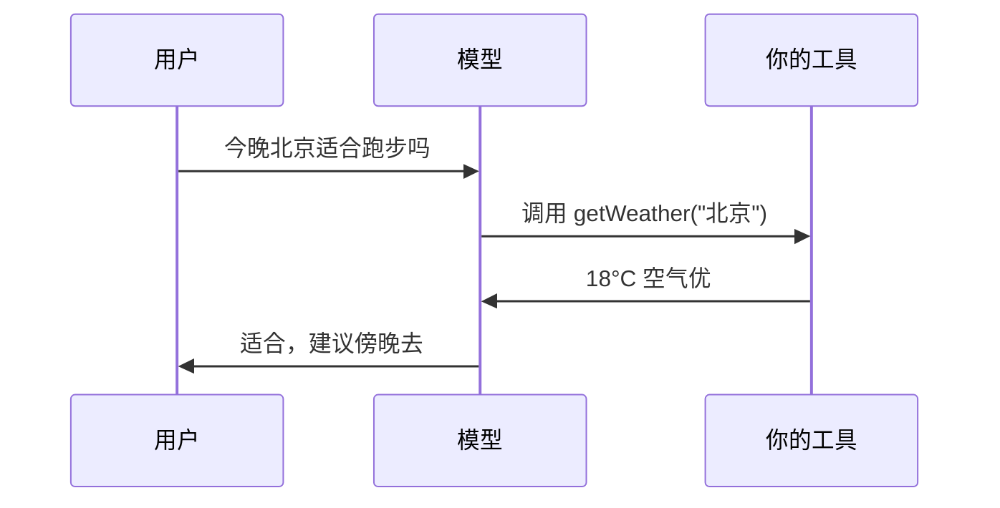

# 核心术语卡：Agent 与 RAG

> 第二叠卡：从"能对话"到"能干活"的那些词。

## 🃏 Function Calling（函数/工具调用）

- **是什么**：模型不直接执行代码，它**输出"我想调用某工具+参数"的 JSON**，你的代码执行后把结果喂回去
- **前端类比**：模型是产品经理（写工单），你的代码是程序员（干活回填）
- **循环**：模型要工具 → 你执行 → 结果回填 → 模型继续 → ……直到给出最终答案

## 🃏 Agent（智能体）

- **是什么**：LLM + 工具 + 记忆 + 循环，能**自主决定下一步**干什么的程序
- **一句话**：会自己拆任务、选工具、看到结果再决定的对话循环
- **误区**：Agent ≠ 更聪明的 chatbot，而是**给模型加了手（工具）和短期记忆（上下文管理）**

## 🃏 ReAct

- **是什么**：最经典的 Agent 模式——**Rea**son（想）→ **Act**（做）→ Observe（看结果）循环
- 前端类比：`while (!done) { 想; 做; 看结果 }`
- LangChain 默认起步范式，LangGraph 就是把这个循环画成图来管

## 🃏 Embedding（嵌入向量）

- **是什么**：把文字变成一串数字（向量），**语义相近 → 距离相近**
- **前端类比**：给每段文字一个"语义坐标"，`{ king } - { man } + { woman } ≈ { queen }`
- **用途**：算相似度 = 搜索的底层

## 🃏 向量数据库

- **是什么**：专门存向量、按"语义距离"高速检索的库（Milvus / PGVector / Qdrant…）
- **前端类比**：普通数据库按主键精确查；向量库按**意思**模糊查——"退货流程"能搜到"如何退货"
- **误区**：不是更高级的 MySQL，是另一种查询范式（相似度，不是精确匹配）

## 🃏 RAG（检索增强生成）

- **是什么**：先检索资料 → 塞进上下文 → 模型**基于资料**回答。给模型外挂一个随时翻的书架
- **为什么**：模型不知道你公司的私有知识；微调又贵又慢；RAG 即插即用
- **一句话本质**：**RAG = 升级版的搜索 + 用模型的话把结果讲出来**

## 🃏 微调（Fine-tuning）

- **是什么**：用你的数据继续训练模型，改变它的行为/风格/领域偏向
- **和 RAG 的分工**（面试高频）：

| | RAG | 微调 |
|---|---|---|
| 改的是 | 模型**看到的**（知识） | 模型**本身**（行为/风格） |
| 成本 | 低，即时生效 | 高，需要训练 |
| 更新知识 | 改文档就行 | 重新训练 |
| 典型场景 | 企业知识库 | 固定输出格式/领域语气 |

- 应用岗认知即可，**别在简历上吹微调除非真做过**

## 🃏 MCP（Model Context Protocol）

- **是什么**：工具接入的统一协议——"AI 界的 USB-C"，Anthropic 开源，已成事实标准
- **解决什么**：以前每个应用 × 每个工具都要写一遍胶水；MCP 之后**工具写一次，所有 Agent 都能用**
- 生态：数千个现成 MCP Server（GitHub、数据库、浏览器……），LangChain/Dify 均已原生支持

## 自测

`RAG 和微调分别改模型的什么？`——能秒答这题，两叠术语卡就毕业了。

→ 想知道这一切底下怎么转：[LLM 原理 3 分钟](/guides/agent-guide/llm-in-3min)
