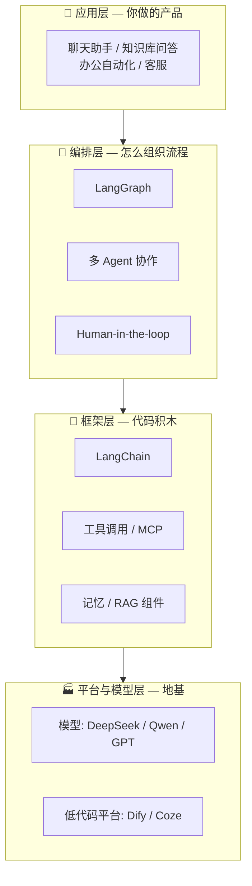

# 一张图看懂 Agent 世界

> 你到处听到的 Dify、LangChain、RAG、MCP……不是并列关系。看懂下面这张分层图，它们就各归其位了。

## 四层地图

| 层 | 一句话 | 代表 | 你什么时候碰它 |
|---|---|---|---|
| **模型层** | 提供智能本身 | DeepSeek、Qwen、GPT | 永远只当 API 用，不碰训练 |
| **平台层** | 不写代码搭应用 | **Dify**、Coze | 入门建全局观 / 快速做 demo |
| **框架层** | 代码级积木 | **LangChain** | 正经开发，岗位要求的核心 |
| **编排层** | 复杂流程与多 Agent | **LangGraph** | 高阶：循环/审批/多角色协作 |

## 一个记忆锚点

> **Dify 让你「看见」Agent 长什么样，LangChain 让你「写」出 Agent，LangGraph 让你「编排」一群 Agent。**

三者的关系是层层递进，不是三选一——这正是姊妹篇《Agent 实战》的行进路线。

## 名词归位表

遇到新名词，先查它属于哪层：

| 你听到的词 | 它在哪层 | 备注 |
|---|---|---|
| RAG / 向量数据库 / Embedding | 框架层组件 | 给模型外挂知识，[术语卡 →](/guides/agent-guide/terms-agent) |
| MCP | 框架层协议 | 工具接入的 USB-C，2026 事实标准 |
| Function Calling | 模型能力 | 一切工具调用的地基 |
| ReAct | 编排模式 | 思考→行动→观察的循环 |
| 微调 | 模型层操作 | 应用岗通常用不上，认知即可 |

## 下一步

- 想先扫盲名词 → [核心术语卡：模型与对话](/guides/agent-guide/terms-core)
- 想直接动手 → 《Agent 实战》第 1 章
