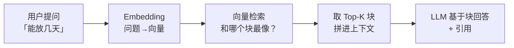

# 知识库与 RAG：喂进你的商品 FAQ

> 场景：hakka-ecommerce（客家特产电商）每天被问"你们的盐焗鸡能放几天""发货到广东要多久"。这些答案躺在商品详情和 FAQ 文档里，模型不知道。这一章用 Dify 知识库把"商品大脑"装进 AI 客服。

## 先造点真实语料（10 分钟）

从 hakka-ecommerce 的商品体系里整理 3 类文档（你也可以用自己项目的真实资料）：

**1. 商品介绍（每商品一段）**

```markdown
# 盐焗鸡（客家传统做法）

- 保质期：常温 3 天，冷藏 7 天，收到后建议当天食用口感最佳
- 规格：整只 900g / 半只 500g
- 配料：三黄鸡、海盐、沙姜、秘制香料
- 储存：0-4°C 冷藏
```

**2. 物流与售后 FAQ**

```markdown
# 配送说明
- 广东省内：次日达（顺丰冷链）
- 省外：2-3 天，泡沫箱+冰袋
- 周五 16:00 后订单周一发出（保鲜考虑）

# 售后
- 生鲜签收后 2 小时内拍照可理赔
- 7 天无理由仅限未拆封的非食品类
```

**3. 产地故事**（营销文案，一段即可）

> 语料质量 = RAG 效果上限。垃圾进垃圾出——这句话在后面 `eng-rag-deep` 章会反复出现。

## 建知识库（5 分钟）

Dify 左栏**知识库** → 创建 → 上传这 3 个 md/txt 文件。关键一步在**分段设置**：

| 参数 | 建议值 | 为什么 |
|---|---|---|
| 分段标识符 | `\n\n`（默认） | 一个段落一个块，语义完整 |
| 最大块长度 | **500 token 左右** | 太小→语义被切碎；太大→检索不准、上下文浪费 |
| 重叠 | 50 | 防止答案正好被切断 |
| 索引方式 | 高质量（Embedding） | 效果远好于"经济"模式 |
| Embedding 模型 | 默认即可 | 云服务自带 |

Dify 2.x 还提供**知识流水线**（Knowledge Pipeline）：抽取→清洗→分块→索引→检索测试的可复用管道——生产项目用它管理"语料到知识库"的更新流，个人项目直接上传够用。

## 召回测试（最容易被跳过、最重要的一步）

知识库界面右上**召回测试**，像给 RAG 写单测：

| 试问 | 期望命中文档 |
|---|---|
| "盐焗鸡收到能放几天？" | 商品介绍-盐焗鸡 |
| "周五下单什么时候发？" | 物流 FAQ |
| "你们鸡是什么鸡？" | 商品介绍-盐焗鸡（配料行） |

**问法换个说法再测**："保质期多久" / "不放冰箱会坏吗" / "能囤吗"——检索是按语义相似度，同义问法都必须命中。命中率不行 → 回去调分段或改写语料，**在这一步迭代比上线后补救便宜一百倍**。

## 接到应用上（3 分钟）

回到上一章的聊天助手 → 编排 → **上下文**里添加这个知识库 → 在 prompt 里加一句：

```text
【知识库使用规则】
- 只根据知识库内容回答商品和物流问题
- 知识库没有的信息，如实说"暂未收录"，不要编造
```

发布。问它"盐焗鸡能放几天"——回答会带引用标记，点开能看到命中的原文块。**一个懂业务的客服机器人成型了。**

## 刚才发生了什么（机制速览）

平台替你跑的完整链路：



记住这张图——第 11 章（`lc-rag`）你会用代码把这条链亲手写一遍，届时 Dify 的每个开关都会变成你代码里的一行。三个现在就能感知的坑：

1. **Top-K 与相关度阈值**：知识库设置里可调。命中太多无关块会稀释回答（还费 token）
2. **rerank**：检索后重排序，多一层"精筛"。数据量上来后打开，命中率明显提升
3. **知识时效**：商品下架了，知识库不会自动知道——更新语料重新索引是运营活

## 前端视角：把它嵌进电商站

Dify 应用发布后拿嵌入代码（iframe 或气泡组件），塞进 hakka-ecommerce 的商品页右下角。更工程化的做法还是走 API（`chat-messages` 接口带 `knowledge` 能力），你自己画聊天 UI——流式渲染、消息列表状态管理，你的本行。

## 下一章

单轮问答不够看了——"下单后自动查物流、催单时自动建工单"这种多步骤流程，上 [工作流编排](/guides/agent-stack/dify-workflow)。
