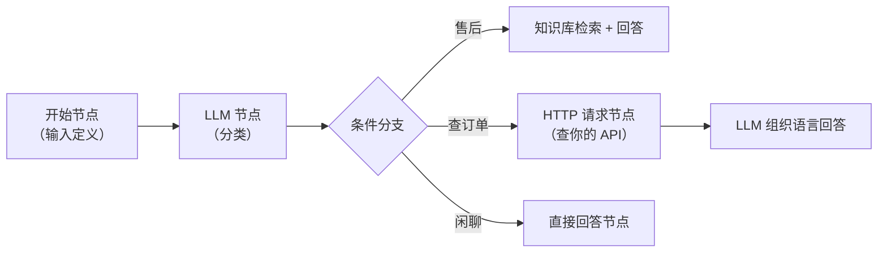

# 工作流编排：节点、条件与变量

> 聊天助手是"一问一答"，真实业务是"一串步骤"。这一章用 Dify 的可视化画布，给客家电商搭一个**智能客服分流工作流**——顺便建立"节点/变量/条件路由"的心智模型，LangGraph 篇的 StateGraph 是同一套思想的代码版。

## Chatflow 还是 Workflow？

| | Chatflow | Workflow |
|---|---|---|
| 交互 | 对话式（每条消息跑一遍流程） | 一次性输入→输出（API 调用/批处理） |
| 例子 | 智能客服、导购 | 每天早上的订单摘要、批量商品文案生成 |
| 记忆 | 自带会话记忆 | 无状态 |

这一章两个都做：**Chatflow 版客服分流**（主线）+ Workflow 版批量文案（练手）。

## 主线：客服分流 Chatflow

新建应用 → Chatflow。画布上先认识零件：



### 节点 1：开始（定义输入变量）

开始节点定义这条流程的输入。Chatflow 自带 `sys.query`（用户这句话）和 `sys.files`。

### 节点 2：LLM 分类器

加一个 LLM 节点，让它输出**机器可读的分类**：

```text
SYSTEM: 你是客服意图分类器。只输出一个词：
- 售后（物流/保质期/理赔相关）
- 订单（查询订单状态）
- 其他
USER: {{#sys.query#}}
```

输出变量 `category`。（这里用 prompt 约束输出——更工程的做法是开 JSON mode，第 2 章讲过）

### 节点 3：条件分支（IF/ELSE）

IF 节点判断 `category == 售后` → 走检索支线；`== 订单` → 走 HTTP 支线；ELSE → 通用回答。

**这就是"条件路由"**——后面前端工程师会秒懂：这就是 `switch`，只是条件由 LLM 动态产出。

### 节点 4a：售后支线（知识库检索 → 回答）

知识检索节点选上一章的商品 FAQ 库，结果作为上下文喂给回答节点。第 4 章的知识库在这里变成了流程里的一个零件。

### 节点 4b：订单支线（HTTP 请求节点）

HTTP 节点调你自己的接口——**这是平台第一次"摸到"你的系统**：

```yaml
GET https://your-api.com/orders/{{#sys.orderId#}}
Headers: Authorization: Bearer xxx
```

返回 JSON 存入变量，回答节点里让 LLM 用人话组织："您的盐焗鸡昨天已从梅州发出，顺丰冷链，预计明天到"。

> 注意安全问题：API Key 写在平台里有泄露面；生产上应调你后端的一个"代查接口"，由后端做鉴权和脱敏，Dify 永远只碰脱敏数据。

### 节点 5：回答节点

三个分支汇合到回答节点，引用各支线变量组织最终答复。

## 变量系统（画布的"数据总线"）

Dify 的变量引用语法 `{{#节点id.字段#}}` 本质是一条**显式的数据流**：

- 每个节点声明输出变量 → 下游节点显式引用 → 画布上连线即依赖
- **变量推荐打开**：节点配置里能直接点选可用变量，不用手写

这套"数据在节点间显式流动"的设计，和 React 的 props 单向数据流同构——你的前端直觉直接复用。也是理解 LangGraph State（"所有节点读写同一个状态对象"）的最佳铺垫，两种范式的差异到 `lg-state-graph` 章对照。

## 练手：批量商品文案 Workflow

新建 Workflow（非对话），四节点串起来：

```
开始(输入: 商品名+卖点数组)
→ 代码节点（把卖点数组拼成 markdown 列表；写一点 JS 就行）
→ LLM 节点（生成小红书风格文案，60 字内 + 3 个 tag）
→ 结束（输出变量：文案）
```

跑一次输入"盐焗鸡/非遗工艺/冷链直达"，得到一条文案。Workflow 可以作为 API 被你的管理后台循环调用——**批量生成 100 条商品文案就是 100 次 API 调用**，这就是"AI 内容生产线"的最小形态。

## 调试：单节点运行

画布右上每个节点可以**单独测试**（给这个节点的输入变量填测试值，只跑它一个）——像单元测试。流程卡住时，从出错节点往前逐个单测定位，这是排障的第一手段。

## 平台能力边界（这一章的暗线）

注意到没有：流程里出现了**代码节点**（你写 JS）和 **HTTP 节点**（调你的系统）。当需求继续复杂——跨步骤的复杂状态、动态决定流程走向、审批中断后恢复——画布会越来越难表达。**下一章正面复刻一个完整业务，把这个边界踩实。**

## 下一章

[实战：用 Dify 复刻烹饪助手](/guides/agent-stack/dify-cooking-app)——把 cooking-app 的完整问答体验在 Dify 上重做一遍，然后回答那个问题：什么时候必须离开平台。
