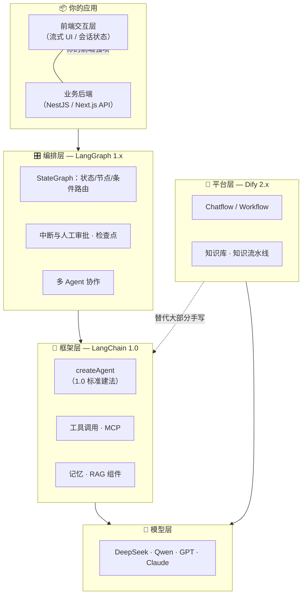
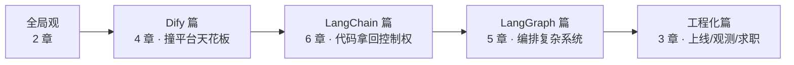

# 一张图看懂 Agent 技术栈

> 姊妹篇《认知地图》教你"名词各归其位"，这一章回答工程师视角的问题：**每一层替你做了什么、不做什么，岗位面试怎么考，这本书怎么带你走完全程。**

## 为什么从这张图开始

面试官最爱问的不是"你会不会用 Dify"，而是：

> "这个需求你为什么选平台、为什么选框架、什么时候必须自己写代码？"

答不上取舍 = 只会跑 demo。下面这张图就是取舍的坐标系。

## 分层全景（2026 版）

**一句话版本**：模型层提供智能 → 平台层（Dify）不写代码搭出 80% 场景 → 框架层（LangChain）用代码获得全部控制 → 编排层（LangGraph）解决复杂流程与多 Agent。你的前端技能直接变现在最上面的交互层。

## 每层的"做了/没做"账本

| 层 | 替你做了 | 不替你做 | 什么时候你会撞到天花板 |
|---|---|---|---|
| **模型 API** | 生成/续写、FC 能力 | 记忆、重试、工具执行 | 第一天——裸调没有多轮和错误处理 |
| **Dify 2.x** | 应用壳、知识库、可视化流程、发布 | 深度定制逻辑、复杂状态、和现有系统深度集成 | 需求稍复杂就开始"绕着平台写代码" |
| **LangChain 1.0** | 模型 IO 抽象、工具封装、记忆、createAgent | 复杂流程控制、审批中断 | 流程有循环/分支/人工节点时 |
| **LangGraph 1.x** | 状态图、条件路由、检查点、HITL、多 Agent | ——（到这就是全控制权） | 你到了这里，剩下的只是工程问题 |

> **本书主线 = 逐层撞天花板**：先在 Dify 上撞（第 5 章），再在 LangChain 里重写（第 10 章），最后用 LangGraph 做真正复杂的（第 17 章）。每一层都拿真实项目练。

## 岗位视角：JD 怎么考这三层

| JD 原文 | 考的实际是 | 对应本书 |
|---|---|---|
| "熟悉 Dify/Coze 等平台" | 你知道平台能干嘛、边界在哪 | Dify 篇 4 章 |
| "精通 LangChain" | 工具调用/记忆/RAG 的**机制**理解 | LangChain 篇 6 章 |
| "Agent 编排经验" | 多 Agent/工作流/状态管理 | LangGraph 篇 5 章 |
| "MCP 经验优先" | 会写一个 MCP Server | `lc-mcp` 章 |
| "有 RAG 落地经验" | 切块/检索/评测全套 | `dify-rag` → `lc-rag` → `eng-rag-deep` |

注意一个行业事实（2025.10 起）：**LangChain 和 LangGraph 都已 1.0 GA**——`createAgent` 取代了旧的 AgentExecutor 成為标准建法，网上大量 0.x 教程已过时。本书代码全部基于 1.x API，这本身就是差异化。

## 成本视角（工程师容易忽略的一层）

选型不只是"哪个好"，还有"哪个便宜"：

| 方案 | 钱 | 时间 |
|---|---|---|
| Dify 云服务 | 免费档起步（够学完本书 Dify 篇） | 20 分钟上线 |
| Dify 自部署 | 一台 2C4G 服务器（~¥60/月） | 半天运维 |
| 裸写（DeepSeek API） | 按 token 计费，学习期每月几块钱 | 最慢但全懂 |
| LangSmith 云观测 | 免费档够用 | 顺手 |

**本书的选择**：Dify 用云服务版（零运维直接学），代码全走 DeepSeek API（国内直连、便宜、兼容 OpenAI 协议）。

## 本书怎么走（20 章地图）

三个贯穿全书的项目（不是虚构 demo）：

- **cooking-app**（Flutter + NestJS 烹饪助手）：已有裸 SDK 集成 → Dify 复刻 → LangChain 重构
- **hakka-ecommerce**（客家电商）：无 AI → 用商品 FAQ 做 RAG 实战
- **lovelyPet**（萌宠社区）：多 Agent 日记工作流 + TS/Python 技术决策复盘

## 下一章

先把地基打牢——[前置地基：LLM API 与 Prompt 基础](/guides/agent-stack/llm-basics)。带你读一段**真实的**生产代码（cooking-app 的 AI 服务），看懂 Dify 替你藏起来的那一层。
